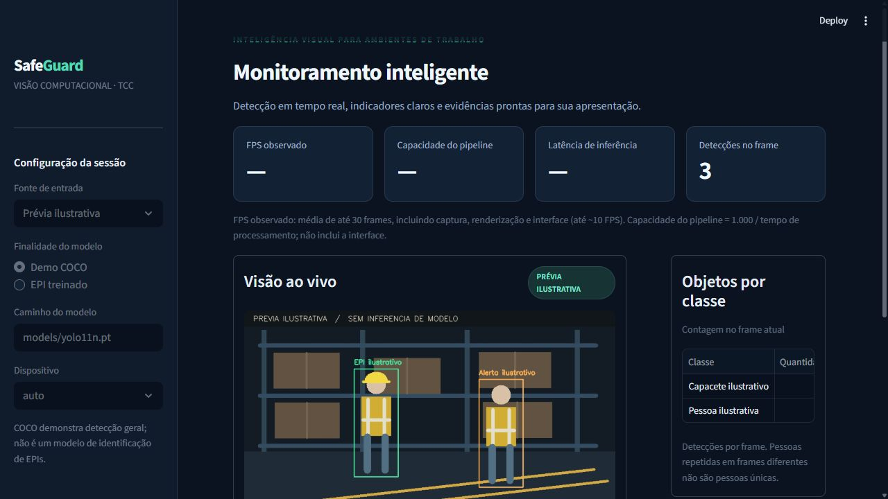

# SafeGuard · Visão computacional para EPI

Dashboard local para demonstração acadêmica de detecção de pessoas e EPIs,
com pipeline modular, YOLO11/YOLOv8, métricas ao vivo e relatórios portáteis.

> O modelo oficial COCO demonstra detecção geral. Para detectar capacetes e
> coletes, use pesos treinados em dataset EPI. A prévia ilustrativa é identificada
> na tela e não representa inferência ou precisão de um modelo.



## Quickstart em 2 passos

Requisito: Python **3.10–3.13** completo, recomendado 3.12, com internet no
primeiro setup. Windows, Linux e macOS; em Linux/macOS use `python3` se necessário.

1. Clone o repositório e entre na pasta:

   ```bash
   git clone https://github.com/nicolassantana42/projeto-tcc.git
   cd projeto-tcc
   ```

2. Execute um comando:

   ```bash
   python run.py
   ```

O inicializador cria `.venv`, instala dependências fixadas e baixa o YOLO11n
oficial para `models/`. Abra **http://localhost:8501**, escolha uma fonte e clique
**Iniciar**. `python run.py --no-download` abre a prévia sem baixar pesos.
`python run.py --install-only` prepara o ambiente sem iniciar o servidor.

## Durante a demonstração

- **Fontes:** webcam conectada ao servidor, upload de vídeo ou RTSP/IP.
- **Controles:** confiança e IoU ajustáveis durante a execução; Iniciar/Parar.
- **Indicadores:** FPS observado, capacidade do pipeline, latência, contagens
  por classe e alertas de possível ausência de EPI.
- **Evidências:** preparar exportação e baixar PNG ou ZIP contendo CSV, JSON e
  snapshot. Histórico limitado aos últimos 300 frames; contagens não são pessoas únicas.

Use **Demo COCO** com `models/yolo11n.pt`. Para **EPI treinado**, selecione seus
pesos e confira classes positivas `person`, `helmet`, `vest` ou aliases
documentados. COCO não gera alertas de ausência de EPI. Alertas reais são
heurísticos por frame, sem rastreamento persistente ou confirmação temporal.

A interface atualiza até aproximadamente 10 FPS. O FPS do pipeline exclui a
interface e não deve ser confundido com FPS exibido. Arquivos são processados
sequencialmente, sem garantia de reprodução na taxa original.

## CLI: inferência, treino e validação

Ative `.venv` antes dos comandos: no PowerShell,
`.\.venv\Scripts\Activate.ps1`; no Linux/macOS, `source .venv/bin/activate`.
Se ativação estiver bloqueada, use diretamente `.venv/Scripts/python.exe` no Windows.
Nos exemplos, substitua `data/demo.mp4` pelo caminho do seu vídeo; essa mídia
não é distribuída com o projeto.

```bash
python -m safeguard infer --source 0 --max-frames 100 --snapshot reports/webcam.png
python -m safeguard infer --source data/demo.mp4 --model models/ppe/best.pt --ppe
python -m safeguard train --model models/yolo11n.pt --data data/ppe.yaml --epochs 100
python -m safeguard validate --model runs/train/ppe/weights/best.pt --data data/ppe.yaml
```

Copie `data/ppe.example.yaml` para `data/ppe.yaml`, configure os caminhos e
prepare as imagens/anotações. Não há dataset ou pesos EPI incluídos. Validação
gera matriz de confusão, curvas PR e JSON com mAP, precisão, recall e ambiente.
Veja [treinamento e avaliação](docs/ML.md) para metodologia, classes e comandos completos.

## Exportação e hardware

```bash
python -m pip install -e ".[onnx]"
python -m safeguard export --model models/yolo11n.pt --format onnx --precision fp32
python -m safeguard benchmark --model models/yolo11n.onnx --source data/demo.mp4 --output runs/onnx.json
```

PyTorch seleciona **CUDA → MPS → CPU**. ONNX utiliza o runtime disponível,
OpenVINO usa CPU e TensorRT exige NVIDIA. FP16 é usado em inferência PyTorch
CUDA. Instale PyTorch com suporte CUDA adequado se sua instalação for CPU;
o seletor só utiliza dispositivos disponíveis no PyTorch instalado.

INT8 via OpenVINO/TensorRT exige dataset de calibração explícito. ONNX FP32 não
é quantização. [Comandos de exportação INT8 e comparação](docs/ML.md#onnx-e-quantização).
Ganhos de mAP/FPS precisam ser medidos nos seus dados e hardware.

## Docker

```bash
docker compose up --build
```

Abra http://localhost:8501. A imagem CPU executa como usuário sem privilégios e
começa com prévia ilustrativa; não baixa pesos ao iniciar. Para detecção, coloque
pesos em `models/` (volume montado) ou baixe-os antes com a CLI.
Upload/RTSP funcionam sem acesso USB. Webcam no Docker requer mapeamento de
dispositivo no Linux; Windows/macOS Docker Desktop não encaminha USB
automaticamente. Apple MPS funciona na execução Python nativa, não no container Linux.
Diretórios montados precisam permitir escrita ao UID 10001 quando houver gravação.

## Estrutura

```text
src/safeguard/
  capture.py        # Fonte, timeout, EOF e desconexão
  preprocessing.py # Validação BGR uint8
  inference.py     # Adaptador YOLO e backends
  hardware.py      # CUDA / MPS / CPU
  pipeline.py      # Coordenação e métricas
  rules.py         # Associação pessoa / EPI
  rendering.py     # Desenho independente da inferência
  reporting.py     # JSON / CSV / PNG / ZIP
  ml.py, cli.py    # Treino, validação, exportação e benchmark
  ui/app.py        # Dashboard Streamlit
models/            # Pesos locais ignorados pelo Git
data/              # Configuração de dataset
docs/              # Arquitetura, plano e evidências de validação
tests/             # Testes sem câmera ou downloads
run.py             # Setup e inicialização em um comando
```

## Testes e diagnóstico

```bash
python -m pip install -e ".[dev]"
python -m pytest -q
python -m pip check
```

Testes de integração opcionais com pesos COCO oficiais e extras instalados:

```bash
python scripts/smoke.py
python scripts/smoke_validation.py --int8
```

O segundo comando usa uma fixture artificial para verificar as APIs de gráficos
e quantização. Seus números de precisão não são resultados científicos.

[Validação realizada e limitações](docs/VALIDATION.md) ·
[Plano de refatoração e auditoria](docs/REFACTOR_PLAN.md) ·
[Arquitetura e regras](docs/ARCHITECTURE.md).

Modelo ausente: execute `python -m safeguard download` ou ajuste o caminho.
Vídeo vazio/corrompido: confirme que o codec é decodificável por OpenCV.
Webcam desconectada: verifique índice/permissões e reinicie a sessão. Falta de
GPU usa CPU quando o formato permite; `.engine` não funciona sem NVIDIA.
Erros detalhados: `python -m safeguard --debug <subcomando> ...`.

## Decisão técnica

A auditoria encontrou YOLOv8 já instalado, mas entradas legadas incompatíveis.
YOLO11n é o novo baseline configurável; YOLOv8n permanece disponível para
comparação com o mesmo dataset. A refatoração separa captura, inferência e UI
e preserva o código anterior no histórico Git. Email/Telegram, SQLite
multicâmera e empacotamento EXE dos fluxos antigos não fazem parte desta versão.

Referências: [YOLO11](https://docs.ultralytics.com/models/yolo11/),
[Ultralytics 8.3.203](https://github.com/ultralytics/ultralytics/tree/v8.3.203),
[validação](https://docs.ultralytics.com/modes/val/),
[Streamlit fragments](https://docs.streamlit.io/develop/api-reference/execution-flow/st.fragment).
Consulte as licenças dos pesos e dependências antes de redistribuir o produto.
