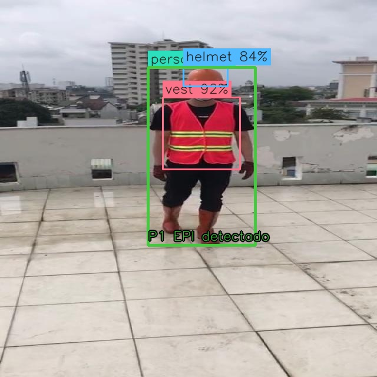

# SafeGuard · Detecção de pessoas, capacetes e coletes

Pipeline local para o TCC: **imagem/câmera → YOLO de pessoas → segundo YOLO de EPIs → decisão por pessoa → evidência**. A execução principal é pela CLI; a interface simples serve para visualizar o resultado.

O primeiro estágio usa YOLO11n COCO. O segundo usa **YOLO11n ajustado localmente por 10 épocas no dataset público Construction-PPE**, em `models/ppe/best.pt`. Esse treinamento inicial substitui um candidato público YOLOv8n que apresentou desempenho insuficiente, especialmente para coletes. Ainda faltam validação no ambiente de uso e comparação controlada com YOLOv5. O mAP de **0,841 citado no artigo não está comprovado como resultado deste projeto**. [Experimentos e métricas medidos](docs/VALIDATION.md) · [Aderência aos documentos](docs/TCC_ALIGNMENT.md).



Exemplo real de pessoa, capacete e colete detectados na primeira imagem do split de validação em ordem alfabética (`image1010.jpg`, Construction-PPE). As porcentagens das caixas são confiança do modelo, não precisão medida no dataset. Consulte os erros e métricas agregados antes de interpretar esta imagem.

## Executar a detecção

Requisito: Python **3.10–3.13** completo, recomendado 3.12. Na raiz do repositório:

```bash
python run.py --install-only
```

Ative o ambiente no PowerShell com `.\.venv\Scripts\Activate.ps1`, ou no Linux/macOS com `source .venv/bin/activate`. Se a ativação estiver bloqueada, substitua `python` nos próximos comandos pelo executável da `.venv`.

Nesta instalação, os pesos treinados já estão preparados. Execute sobre **uma imagem sua**:

```bash
python -m safeguard detect --source data/minha-imagem.jpg --show --snapshot reports/resultado.jpg
```

`data/minha-imagem.jpg` é um caminho de exemplo, que deve ser substituído por um arquivo existente. A detecção não baixa pesos implicitamente. A janela OpenCV exibe caixas e estados; **Q** encerra.

Em um **clone novo**, pesos e dataset não vêm do Git. Prepare os dados e reproduza o treinamento, ou forneça seus próprios pesos EPI:

```bash
python scripts/prepare_ppe.py --dataset
python -m safeguard audit-data --data data/construction-ppe.yaml --require-test
python -m safeguard train --model models/yolo11n.pt --data data/construction-ppe.yaml --epochs 10 --imgsz 416 --batch 8 --device cpu --name ppe_tcc
python -m safeguard detect --source data/minha-imagem.jpg --ppe-model runs/train/ppe_tcc/weights/best.pt --show
```

O primeiro comando precisa de internet; o treino em CPU pode demorar. Conclua a avaliação descrita abaixo antes de interpretar os resultados. O preparo também disponibiliza o candidato externo `baseline-public.pt` para comparação; ele foi descartado como modelo principal, não é um substituto de qualidade equivalente. Para usar o caminho padrão em um clone novo, copie o modelo treinado conforme o [protocolo de ML](docs/ML.md#dataset-e-treinamento). Repetições do treino podem criar diretórios com sufixos; use o caminho indicado na execução.

Para vídeo ou webcam:

```bash
python -m safeguard detect --source data/meu-video.mp4 --show --max-frames 1000 --save-events --camera-name "Entrada da obra" --location "Bloco B"
python -m safeguard detect --source 0 --show --max-frames 1000
```

RTSP também é aceito em `--source`. Sem `--show`, a inferência funciona sem janela. `--person-model` e `--ppe-model` permitem trocar os pesos dos dois estágios; `--confidence`, `--iou`, `--imgsz` e `--device` controlam a execução. O limite padrão é 300 quadros. Use `--output` para separar os relatórios; o caminho padrão é `runs/detection/frames.jsonl`.

## O que a detecção afirma

O segundo YOLO executa uma vez no quadro completo **somente quando o primeiro encontra pessoas**. Equipamentos são associados espacialmente a cada pessoa. As caixas e os tempos dos estágios ficam no relatório, junto com o estado:

| Estado | Interpretação |
| --- | --- |
| `ok` | Capacete e colete detectados e associados; não certifica segurança. |
| `unsafe` | Classe negativa explícita, como `no_helmet` ou `no_vest`, associada sem ambiguidade; requer revisão. |
| `uncertain` | Equipamento não detectado, associação ambígua, conflito ou pessoa cortada; insuficiente para concluir ausência. |

Não detectar um capacete **não prova** que a pessoa esteja sem ele. Oclusão, distância e iluminação afetam a inferência. O escopo inicial cobre **capacete e colete**; outras classes dos pesos não ampliam automaticamente esse escopo. Construction-PPE possui `no_helmet`, mas não `no_vest`: nesses pesos, colete não detectado permanece inconclusivo. COCO sozinho detecta pessoas e objetos gerais, sem reconhecer EPIs.

`--snapshot` salva o último quadro anotado. `--save-events` registra somente observações `unsafe`: em vídeo, exige continuidade por 2 segundos da fonte e aplica intervalo de 60 segundos por sessão de câmera; em imagem estática, registra uma observação única, identificada assim no motivo.

As evidências ficam em `reports/occurrences/<UUID>/snapshot.jpg` e `event.json`, com câmera, local cadastrado, horário UTC da análise, estados e detecções. Não há gravação contínua. A CLI não envia mensagens externas.

## Avaliar antes de concluir precisão

```bash
python -m safeguard audit-data --data data/construction-ppe.yaml --require-test --output runs/dataset-audit.json
python -m safeguard evaluate-cascade --data data/construction-ppe.yaml --split test --output runs/cascade-evaluation.json
```

O primeiro comando verifica dados e rótulos, incluindo duplicatas entre splits. O segundo mede **TP, FP, FN, precisão, recall e latência do fluxo completo** em limiares fixos. Ele não calcula mAP, não comprova que o dataset seja independente do treinamento do modelo público e não avalia a decisão de conformidade por pessoa. Anotações de caixas e anotações de estado são problemas diferentes.

Para treinamento próprio, mAP, matriz de confusão, curvas PR, calibração INT8 e comparação de arquiteturas, siga [o protocolo de ML](docs/ML.md). Os resultados efetivamente executados estão em [VALIDATION.md](docs/VALIDATION.md).

## Interface e Telegram opcionais

```bash
python run.py
```

Abra **http://localhost:8501** e use a visualização de detecção. Histórico e integrações estão nas abas; **Exibir painel completo** acrescenta estatísticas e a composição visual anterior. Em **Alertas e integrações**, cadastre câmera/local, informe o token do bot e Chat ID, ative Telegram e salve antes de iniciar a captura. Canais começam desativados; salvar configurações não envia mensagens. A CLI funciona independentemente dessas configurações.

Fotos podem ser consultadas em **Ocorrências**. Tokens digitados ficam na sessão; `reports/settings.json` guarda preferências sem credenciais. **Enviar teste aos canais ativos** envia uma mensagem real quando acionado. Outlook é opcional e exige token OAuth2 SMTP fornecido pelo operador; login e renovação Microsoft não estão implementados. [Guia de alertas](docs/ALERTS.md).

Metabase, N8N e frontend Next citados no roteiro **não estão implementados**. O envio atual vai diretamente à API do Telegram. A interface não substitui a validação de detecção solicitada pelo TCC.

## Hardware e container

PyTorch seleciona **CUDA → MPS → CPU**, conforme os dispositivos efetivamente disponíveis. ONNX usa o runtime instalado; OpenVINO usa CPU; TensorRT exige NVIDIA. Exportação ONNX FP32 não é quantização. INT8 exige calibração e nova avaliação da precisão. [Exportação e medições](docs/ML.md#onnx-e-quantização).

```bash
docker compose up --build
```

O container CPU serve a interface em http://localhost:8501. Prepare os pesos antes, na pasta `models/` montada como volume; a inicialização do container não os baixa. Vídeos e RTSP são as fontes mais portáveis. Webcam USB exige mapeamento no Linux; Docker Desktop Windows/macOS não a encaminha automaticamente. MPS requer execução Python nativa. Relatórios persistem no volume `reports/`; diretórios com gravação precisam ser acessíveis ao UID 10001.

## Código e testes

```text
src/safeguard/
  capture.py         # Imagem, vídeo, câmera e tempo da fonte
  preprocessing.py  # Validação BGR uint8
  inference.py      # Adaptador YOLO e backends
  detection.py      # Dois estágios e decisão conservadora por pessoa
  factory.py        # Construção dos modelos
  runner.py         # Execução de detecção sem interface
  evaluation.py     # Avaliação de caixas da cascata
  dataset_audit.py  # Auditoria de dataset e splits
  events.py         # Persistência temporal, JPEG/JSON e retenção
  notifications.py  # Telegram, SMTP e fila de envio
  ml.py, cli.py     # Treino, mAP, exportação e comandos
  ui/               # Visualização e integrações opcionais
models/             # Pesos locais e sua procedência
data/               # YAMLs; datasets baixados são ignorados pelo Git
reports/            # Evidências locais, ignoradas pelo Git
docs/               # Aderência ao TCC, protocolo e validação
tests/              # Testes sem câmera ou mensagens reais
```

```bash
python -m pip install -e ".[dev]"
python -m pytest -q
python -m pip check
```

Testes unitários verificam contratos e erros; não medem a precisão de um modelo em produção. Diagnóstico: `python -m safeguard --debug <subcomando> ...`.

[Arquitetura](docs/ARCHITECTURE.md) · [Aderência ao TCC](docs/TCC_ALIGNMENT.md) · [Treino e avaliação](docs/ML.md) · [Validação realizada](docs/VALIDATION.md).
