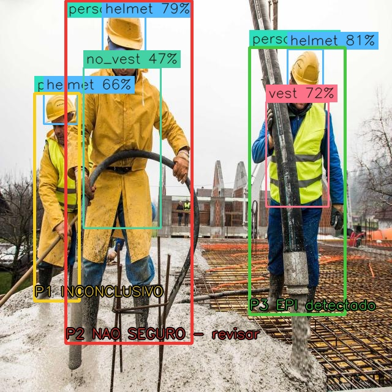
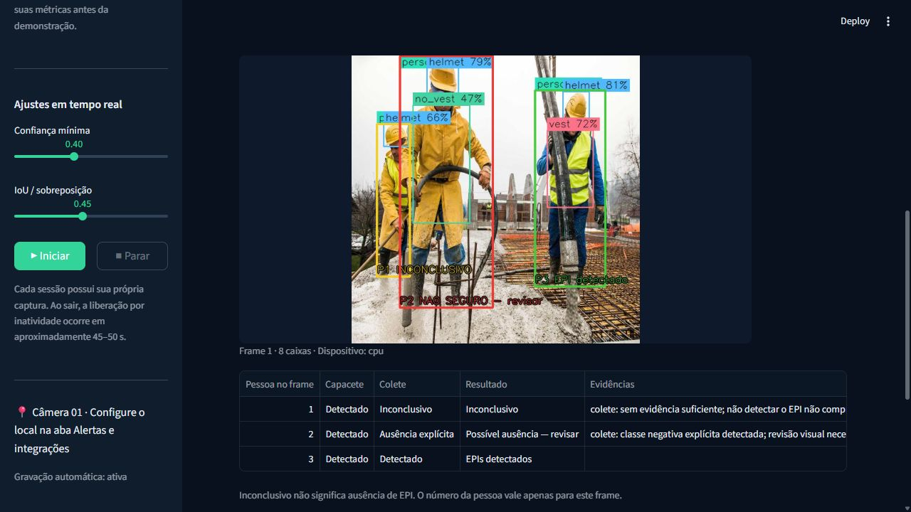

# Detecção de pessoas, capacetes, coletes e botas

## ▶ Como rodar (apresentação)

1. Instale o **Python 3.12** uma única vez: `winget install -e --id Python.Python.3.12`
2. Dê **dois cliques em `iniciar.bat`** (ou rode `python run.py`).
   Na primeira vez ele cria a `.venv` e instala tudo; depois abre direto.
3. No navegador (**http://localhost:8501**): escolha **Imagem**, **Vídeo** ou **Webcam** e clique **▶ Iniciar**.

Cada pessoa aparece com ✅ Detectado / ❌ Ausente / ⚠️ Não detectado para **capacete, colete e bota**.
Imagens de teste prontas: `data/datasets/images/test/` (ex.: `image536.jpg`, `image611.jpg`).

### Modelo ativo: `models/ppe/epi.pt`

YOLO11n treinado em **Construction-PPE** (10 + 40 épocas, CPU, 480 px; `runs/train/ppe_epi3`). Perfil CPU usa `models/ppe/epi_openvino_model` (FP32, ~8 FPS na cascata nesta máquina).

Teste (141 imagens nunca vistas no treino), mAP50:

| Classe | Modelo anterior (`best.pt`) | **`epi.pt`** | Precisão / Recall |
|---|---|---|---|
| Capacete | 0,88 | **0,93** | 0,88 / 0,89 |
| Colete | 0,86 | **0,86** | 0,78 / 0,85 |
| Bota | 0,70 | **0,75** | 0,71 / 0,68 |

Limite: o dataset não tem classe "sem colete"; colete não encontrado aparece como ⚠️ Não detectado.
Retreinar: `python -m epi_monitor train --model models/ppe/best.pt --data data/construction-ppe.yaml --epochs 40 --imgsz 480 --batch 16 --workers 4 --device cpu --name ppe_epi3`

---

Pipeline local para o TCC: **imagem/câmera → YOLO de pessoas → segundo YOLO de EPIs → decisão por pessoa → evidência**. A execução principal é pela CLI; a interface simples serve para visualizar o resultado.

O primeiro estágio usa YOLO11n COCO. O segundo usa **YOLO11n ajustado localmente por 10 épocas no dataset público RF100 Construction Safety**, em `models/ppe/absence.pt`. Ele reconhece capacete, colete, **sem capacete e sem colete**. O modelo anterior (`best.pt`, Construction-PPE) foi preservado para comparação. Ainda faltam validação no ambiente de uso e comparação controlada com YOLOv5. O mAP de **0,841 citado no artigo não está comprovado como resultado deste projeto**. [Experimentos e métricas medidos](docs/VALIDATION.md) · [Procedência dos novos dados e pesos](docs/ABSENCE_DATA.md).



Exemplo selecionado para demonstrar os três estados na imagem pública `ppe_0079` do val, não uma amostra para medir qualidade. À esquerda, o colete não foi reconhecido e a avaliação permanece inconclusiva; ao centro, há detecção explícita de ausência; à direita, capacete e colete associados. Fonte RF100 / Anonymous, espelho LibreYOLO, CC BY 4.0; [atribuição e limites](docs/ABSENCE_DATA.md). As porcentagens das caixas são confiança do modelo, não precisão medida.

**Resultado atual no teste de 90 imagens:** colete com recall de 72,1% e precisão de 86,1%; sem colete com recall de 63,9% e precisão de 69,6%. Sem capacete ainda tem recall de apenas 25%. No teste antigo, o recall dessa ausência subiu de 12,5% para 25%, mas os falsos positivos passaram de 1 para 13. A detecção de ausência ainda exige melhoria e revisão humana; não está validada para fiscalização automática.

**Revisão de 29/09/2026:** os dois modelos têm exports OpenVINO FP32 em 640 preparados nesta instalação. A interface recomenda esse perfil automaticamente em CPU quando os artefatos e o runtime estão disponíveis. O benchmark da cascata passou de **3,49 para 7,31 FPS**, sem captura, interface, gravação ou rede; **25–30 FPS reais não foram atingidos**. O modelo ativo **não detecta botas**. [Revisão para apresentação, validação e pendências](docs/PRESENTATION_CHECK.md).

**Interface em 30/09:** removida a coleta completa de memória forçada a cada atualização. Na comparação com o mesmo vídeo, a taxa com interface passou de **5,43 para 7,57 FPS**, com resultados idênticos nos 103 quadros. A coleta automática normal do Python permanece ativa. Essa medição curta não garante FPS ou estabilidade de memória em sessões longas.

## Executar a detecção

Requisito: Python **3.10–3.13** completo, recomendado 3.12. Na raiz do repositório:

```bash
python run.py --install-only
```

Ative o ambiente no PowerShell com `.\.venv\Scripts\Activate.ps1`, ou no Linux/macOS com `source .venv/bin/activate`. Se a ativação estiver bloqueada, substitua `python` nos próximos comandos pelo executável da `.venv`.

Nesta instalação, os pesos treinados já estão preparados. Execute sobre **uma imagem sua**:

```bash
python -m epi_monitor detect --source data/minha-imagem.jpg --show --snapshot reports/resultado.jpg
```

`data/minha-imagem.jpg` é um caminho de exemplo, que deve ser substituído por um arquivo existente. A detecção não baixa pesos implicitamente. A janela OpenCV exibe caixas e estados; **Q** encerra.

Em um **clone novo**, pesos e dataset não vêm do Git. Prepare os dados e reproduza o treinamento, ou forneça seus próprios pesos EPI:

```bash
python -m epi_monitor download
python scripts/prepare_absence_model.py
python scripts/prepare_absence_data.py
python scripts/prepare_absence_transfer.py
python -m epi_monitor train --model models/ppe/absence-base.pt --data data/ppe-absence-transfer.yaml --epochs 10 --imgsz 416 --batch 8 --device cpu --freeze 10 --name ppe_absence
python -m epi_monitor evaluate-cascade --ppe-model runs/train/ppe_absence/weights/best.pt --data data/ppe-absence.yaml --split val --output runs/absence-val.json
python scripts/promote_absence_model.py --run-dir runs/train/ppe_absence
```

Os downloads precisam de internet; o treino medido levou cerca de 37 minutos nesta CPU. A promoção verifica hash e classes e recusa substituir pesos divergentes; ela não certifica precisão. Use o diretório efetivamente informado pelo treino (repetições podem criar sufixos). O candidato `absence-base.pt` é pré-treinado por terceiros e não equivale ao ajuste local. [Protocolo, avaliação e licenças](docs/ABSENCE_DATA.md).

Para vídeo ou webcam:

```bash
python -m epi_monitor detect --source data/meu-video.mp4 --show --max-frames 1000 --save-events --camera-name "Entrada da obra" --location "Bloco B"
python -m epi_monitor detect --source 0 --show --max-frames 1000
```

RTSP também é aceito em `--source`. Sem `--show`, a inferência funciona sem janela. `--person-model` e `--ppe-model` permitem trocar os pesos dos dois estágios; `--confidence`, `--iou`, `--imgsz` e `--device` controlam a execução. O limite padrão é 300 quadros. Use `--output` para separar os relatórios; o caminho padrão é `runs/detection/frames.jsonl`.

## O que a detecção afirma

O segundo YOLO executa uma vez no quadro completo **somente quando o primeiro encontra pessoas**. Equipamentos são associados espacialmente a cada pessoa. As caixas e os tempos dos estágios ficam no relatório, junto com o estado:

| Estado | Interpretação |
| --- | --- |
| `ok` | Capacete e colete detectados e associados; não certifica segurança. |
| `unsafe` | Classe negativa explícita, como `no_helmet` ou `no_vest`, associada sem ambiguidade; requer revisão. |
| `uncertain` | Equipamento não detectado, associação ambígua, conflito ou pessoa cortada; insuficiente para concluir ausência. |

Não detectar um capacete **não prova** que a pessoa esteja sem ele. Oclusão, distância e iluminação afetam a inferência. O escopo cobre **capacete e colete**; outras classes dos pesos não ampliam automaticamente esse escopo. O novo modelo inclui `NO-Safety Vest`, normalizado para `no_vest`. Nos pesos antigos sem essa classe, a falta de uma caixa de colete permanece inconclusiva. COCO sozinho detecta pessoas e objetos gerais, sem reconhecer EPIs.

`--snapshot` salva o último quadro anotado. `--save-events` registra somente observações `unsafe`: em vídeo, exige continuidade por 2 segundos da fonte e aplica intervalo de 60 segundos por sessão de câmera; em imagem estática, registra uma observação única, identificada assim no motivo.

As evidências ficam em `reports/occurrences/<UUID>/snapshot.jpg` e `event.json`, com câmera, local cadastrado, horário UTC da análise, estados e detecções. Não há gravação contínua. A CLI não envia mensagens externas.

## Avaliar antes de concluir precisão

```bash
python -m epi_monitor audit-data --data data/ppe-absence.yaml --require-test --output runs/dataset-audit.json
python -m epi_monitor evaluate-cascade --data data/ppe-absence.yaml --split test --output runs/cascade-evaluation.json
```

O primeiro comando verifica dados e rótulos, incluindo duplicatas entre splits. O segundo mede **TP, FP, FN, precisão, recall e latência do fluxo completo** em limiares fixos. Ele não calcula mAP, não comprova que o dataset seja independente do treinamento do modelo público e não avalia a decisão de conformidade por pessoa. Anotações de caixas e anotações de estado são problemas diferentes.

Para treinamento próprio, mAP, matriz de confusão, curvas PR, calibração INT8 e comparação de arquiteturas, siga [o protocolo de ML](docs/ML.md). Os resultados efetivamente executados estão em [VALIDATION.md](docs/VALIDATION.md).

## Interface e Telegram opcionais

```bash
python run.py
```

Abra **http://localhost:8501**, escolha imagem, vídeo, webcam ou RTSP e clique **Iniciar**. O quadro mostra as caixas, e a tabela abaixo separa **Capacete / Colete** por pessoa: Detectado, Ausência explícita ou Inconclusivo. Histórico e integrações ficam nas abas; **Exibir painel completo** acrescenta estatísticas. Em **Alertas e integrações**, cadastre câmera/local, informe o token do bot e Chat ID, ative Telegram e salve antes de iniciar a captura. Canais começam desativados; salvar configurações não envia mensagens. A CLI funciona independentemente dessas configurações.

A prévia ocupa a mesma área 16:9 antes e depois de iniciar, com até 720 pixels de largura; as evidências preservam a imagem original. Nesta máquina, mantenha **CPU otimizada (OpenVINO)**. Use **3 análises/s** para aliviar o processamento ou **10** para priorizar fluidez. Selecionar 25 ou 30 apenas aumenta o limite solicitado; acompanhe o **FPS observado** para saber a taxa real. Reinicie o servidor após atualizar o código.

Fotos podem ser consultadas em **Ocorrências**. Tokens digitados ficam na sessão; `reports/settings.json` guarda preferências sem credenciais. **Enviar teste aos canais ativos** envia uma mensagem real quando acionado. Outlook é opcional e exige token OAuth2 SMTP fornecido pelo operador; login e renovação Microsoft não estão implementados. [Guia de alertas](docs/ALERTS.md).



[Veja os campos de configuração do Telegram](docs/images/absence-telegram-ui.png). As capturas usam uma pasta de teste isolada; na execução normal, as imagens e seus registros ficam em `reports/occurrences/`.

Metabase, N8N e frontend Next citados no roteiro **não estão implementados**. O envio atual vai diretamente à API do Telegram. A interface não substitui a validação de detecção solicitada pelo TCC.

## Hardware e container

PyTorch seleciona **CUDA → MPS → CPU**, conforme os dispositivos efetivamente disponíveis. ONNX usa o runtime instalado; OpenVINO usa CPU; TensorRT exige NVIDIA. Exportação ONNX FP32 não é quantização. INT8 exige calibração e nova avaliação da precisão. [Exportação e medições](docs/ML.md#onnx-e-quantização).

```bash
docker compose up --build
```

O container CPU serve a interface em http://localhost:8501. Prepare os pesos antes, na pasta `models/` montada como volume; a inicialização do container não os baixa. Vídeos e RTSP são as fontes mais portáveis. Webcam USB exige mapeamento no Linux; Docker Desktop Windows/macOS não a encaminha automaticamente. MPS requer execução Python nativa. Relatórios persistem no volume `reports/`; diretórios com gravação precisam ser acessíveis ao UID 10001.

## Código e testes

```text
src/epi_monitor/
  capture.py         # Imagem, vídeo, câmera e tempo da fonte
  preprocessing.py  # Validação BGR uint8
  inference.py      # Adaptador YOLO e backends
  detection.py      # Dois estágios e decisão conservadora por pessoa
  factory.py        # Construção dos modelos
  runner.py         # Execução de detecção sem interface
  evaluation.py     # Avaliação de caixas da cascata
  dataset_audit.py  # Auditoria de dataset e splits
  events.py         # Persistência temporal, JPEG/JSON e retenção
  notifications.py  # Telegram, SMTP e fila de envio
  ml.py, cli.py     # Treino, mAP, exportação e comandos
  ui/               # Visualização e integrações opcionais
models/             # Pesos locais e sua procedência
data/               # YAMLs; datasets baixados são ignorados pelo Git
reports/            # Evidências locais, ignoradas pelo Git
docs/               # Aderência ao TCC, protocolo e validação
tests/              # Testes sem câmera ou mensagens reais
```

```bash
python -m pip install -e ".[dev]"
python -m pytest -q
python -m pip check
```

Em **29/09/2026, 558 testes passaram**; dependências, compilação e inicializador também foram verificados. Os testes verificam contratos e erros; não medem a precisão de um modelo em produção. Diagnóstico: `python -m epi_monitor --debug <subcomando> ...`.

[Arquitetura](docs/ARCHITECTURE.md) · [Aderência ao TCC](docs/TCC_ALIGNMENT.md) · [Treino e avaliação](docs/ML.md) · [Validação realizada](docs/VALIDATION.md) · [Revisão para apresentação](docs/PRESENTATION_CHECK.md).
