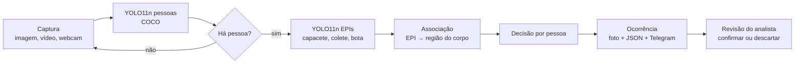

<p align="center"></p>

# Monitor de EPIs — detecção de capacete, colete e bota com YOLO11

Trabalho de Conclusão de Curso. Sistema de visão computacional que analisa imagens, vídeos ou câmera e indica, **para cada pessoa**, se ela está usando **capacete, colete e bota**. Quando detecta a falta de um EPI, registra uma ocorrência com foto e pode enviar um alerta pelo Telegram.

## Problema e objetivo

A fiscalização do uso de EPI em obras é feita, em geral, por inspeção visual, o que é caro e sujeito a falhas. O objetivo deste trabalho é **apoiar** o fiscal: detectar automaticamente os EPIs em imagens de câmeras, registrar as evidências e deixar a decisão final para um analista humano, que confirma ou descarta cada ocorrência.

## Como funciona


```mermaid
flowchart LR
    A[Captura<br/>imagem, vídeo, webcam] --> B[YOLO11n pessoas<br/>COCO]
    B --> C{Há pessoa?}
    C -- não --> A
    C -- sim --> D[YOLO11n EPIs<br/>capacete, colete, bota]
    D --> E[Associação<br/>EPI → região do corpo]
    E --> F[Decisão por pessoa]
    F --> G[Ocorrência<br/>foto + JSON + Telegram]
    G --> H[Revisão do analista<br/>confirmar ou descartar]
```

1. **Detecção de pessoas**: um YOLO11n treinado no COCO encontra as pessoas no quadro.
2. **Detecção de EPIs**: só se houver pessoa, um segundo YOLO11n, treinado neste trabalho, procura capacete, colete e bota.
3. **Associação**: cada EPI é ligado à pessoa pela posição no corpo (capacete na cabeça, colete no tronco, bota nos pés).
4. **Decisão por pessoa**, de forma conservadora:
   - ✅ **Detectado**: o EPI foi visto nessa pessoa.
   - ❌ **Ausente**: o modelo viu explicitamente "sem capacete" ou "sem bota".
   - ⚠️ **Não detectado**: o EPI não foi visto (pode estar encoberto, distante ou fora do quadro). Não ver um EPI não prova que ele está ausente.
5. **Evidência**: quando a ausência se mantém por 2 segundos no vídeo, o sistema salva foto e registro e, se configurado, avisa pelo Telegram.

## Resultados

Detector de EPIs: **YOLO11n**, treinado por 50 épocas no dataset público **Construction-PPE** (1.132 imagens de treino, 143 de validação e 141 de teste). Medido no **conjunto de teste**, com imagens nunca usadas no treino:

| EPI | Precisão | Recall | mAP50 |
|---|---|---|---|
| Capacete | 89,2% | 90,4% | **94,0%** |
| Colete | 79,4% | 87,1% | **89,3%** |
| Bota | 72,7% | 72,0% | **76,4%** |

- **Precisão**: das detecções feitas, quantas estavam certas.
- **Recall**: dos EPIs existentes, quantos foram encontrados.
- **mAP50**: métrica padrão de detecção de objetos (média da precisão em todos os níveis de confiança, considerando acerto quando a caixa coincide em pelo menos 50% com a real).

**Velocidade** (notebook Intel i7-1355U, sem placa de vídeo): ≈ **13 quadros por segundo** com OpenVINO a 480 px, ou ≈ 18 no modo rápido. Na interface, contando a exibição na tela, ≈ 7 quadros por segundo.

Fonte dos números: `models/ppe/epi.metrics.json` e `runs/train/ppe_epi3/`. Treino, desempenho e o que não deu certo: [docs/MODELO.md](docs/MODELO.md).

## Tecnologias

| Uso | Tecnologia |
|---|---|
| Detecção de objetos | Ultralytics YOLO11n 8.3.203 |
| Treino e inferência | PyTorch 2.8 (CPU) e OpenVINO 2025.4 (otimização para CPU Intel) |
| Vídeo e imagem | OpenCV 4.12 |
| Interface | Streamlit 1.49 |
| Alertas | API do Telegram |
| Linguagem | Python 3.12 |

## Como rodar

1. Instale o **Python 3.12** (uma vez): `winget install -e --id Python.Python.3.12`
2. Clone o repositório. Os modelos treinados já vêm junto.
3. Dê **dois cliques em `iniciar.bat`** (ou rode `python run.py`). Na primeira vez ele cria o ambiente e instala as dependências (precisa de internet, ~3 a 5 min).
4. O navegador abre em **http://localhost:8501**. Entre com o acesso de demonstração:

   | Usuário | Senha |
   |---|---|
   | `admin` | `epi2026` |

   Para trocar, crie `.streamlit/secrets.toml` com a seção `[login]` (modelo em `.streamlit/secrets.example.toml`) ou defina `EPI_LOGIN_USER` e `EPI_LOGIN_PASSWORD`.

## Como usar

1. Na barra lateral, escolha a **fonte**:

   | Fonte | O que informar |
   |---|---|
   | Arquivo de vídeo | *Caminho no computador* (o vídeo de demonstração `data/demo/demo_obra.mp4` já vem preenchido) |
   | Imagem | *Enviar arquivo* com uma foto que tenha pessoas |
   | Webcam local | índice `0` |

2. Clique **▶ Iniciar**. A aba **Monitor** mostra o vídeo com as caixas e, ao lado, cada pessoa com o estado de capacete, colete e bota.
3. A aba **Ocorrências** guarda as fotos de quem apareceu sem EPI. O analista revisa cada uma com **Confirmar** ou **Descartar**.
4. Na aba **Configurações** ficam o nome da câmera, o local e o alerta pelo Telegram ([guia](docs/ALERTS.md)).

## Limitações

- O dataset não tem a classe "sem colete": um colete não visto fica como ⚠️, nunca como ❌.
- "Sem capacete" e "sem bota" têm poucos exemplos no dataset, então o sistema detecta melhor quem **está** com EPI do que quem está **sem**.
- O modelo foi treinado com imagens públicas, sem coleta no local de uso.
- A meta de 25–30 FPS não foi atingida em CPU; seria necessária uma GPU NVIDIA.
- Metabase, N8N e frontend em Next.js, previstos no roteiro, ficaram como trabalhos futuros.

## Estrutura do projeto

```text
iniciar.bat, run.py        inicialização com um comando
src/epi_monitor/
  detection.py             cascata, associação EPI → pessoa e decisão
  inference.py             execução do YOLO (PyTorch ou OpenVINO)
  capture.py               leitura de imagem, vídeo, webcam e RTSP
  events.py                ocorrências (foto + JSON) e revisão do analista
  notifications.py         envio pelo Telegram e e-mail
  ml.py, cli.py            treino, validação e linha de comando
  ui/                      interface Streamlit
models/                    pesos YOLO11 (pessoas e EPIs) usados pela aplicação
data/                      configuração do dataset e vídeo de demonstração
docs/                      documentação técnica, alertas, roteiro da apresentação
tests/                     518 testes automatizados (python -m pytest -q)
```

## Documentação

- [Modelo: treino, métricas, desempenho e limitações](docs/MODELO.md)
- [Alertas pelo Telegram](docs/ALERTS.md)
- [Aderência ao roteiro do TCC](docs/TCC_ALIGNMENT.md)
- [Roteiro da apresentação e perguntas da banca](docs/APRESENTACAO.md)
