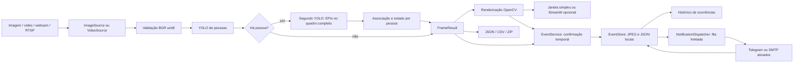

# Arquitetura e contratos

`VideoSource` é um context manager e libera recursos mesmo quando a inferência
falha. Arquivos terminam em EOF; desconexões e vídeos sem frames geram
`CaptureError`. Streams FFmpeg usam timeout de abertura/leitura de 5 s.
Webcams dependem do driver do sistema; alguns drivers podem bloquear além
desse limite. Reconexão é explícita pelo botão Iniciar.

`open_source` escolhe `ImageSource` para imagem estática e `VideoSource` para
vídeo/câmera. Imagens são decodificadas uma vez, sem loop artificial de quadros.
Em arquivos, `timestamp_seconds` usa a posição da mídia, com fallback de
índice/FPS; fontes ao vivo usam relógio monotônico. Essa distinção permite
avaliar persistência na linha do tempo do vídeo, independente do FPS de análise.

`preprocess_frame` valida dimensões, canais BGR e dtype uint8 e garante memória
contígua. Resize/letterbox/normalização ficam no backend Ultralytics, que também
restaura as caixas às coordenadas originais. Não há letterbox duplicado.

`YOLODetector` carrega uma vez por sessão e transforma resultados de qualquer
backend em `Detection(class_id, label, confidence, bbox)`. A biblioteca é
carregada tardiamente. Ausência de GPU permite CPU nos formatos compatíveis;
TensorRT exige CUDA. Pesos inexistentes não provocam downloads implícitos.

`CascadePipeline`, em `detection.py`, coordena duas instâncias independentes
de `YOLODetector`, construídas por `factory.py`. O primeiro modelo fornece
pessoas; somente quando há pessoas válidas o segundo executa. O modelo EPI
examina o quadro completo uma vez, preservando contexto e escala; não há
uma inferência por recorte. As pessoas produzidas pelo segundo modelo não
duplicam as do primeiro estágio.

`FrameResult` contém o frame original, caixas canônicas, contagens, avaliações
por pessoa, alertas, índice, tempos por estágio e informação de execução do
estágio EPI. `render_frame` desenha em uma cópia. `runner.py` liga fonte,
cascata, JSONL, janela OpenCV e evidências sem importar Streamlit. O `Pipeline`
simples permanece para demonstração geral COCO e compatibilidade; ele não é
o caminho principal de análise EPI.

Os pesos de trabalho de EPI vêm de treinamento inicial local em dataset
público e têm procedência registrada. A cascata não pressupõe qualidade
validada no local de implantação. `evaluation.py` mede
caixas finais em limiares fixos; `ml.py` avalia mAP de um detector com seu
dataset compatível. Ambos ficam independentes da interface.

## Hardware

| Artefato | Seleção automática |
| --- | --- |
| PyTorch `.pt` | CUDA → MPS → CPU |
| ONNX | CUDA quando PyTorch CUDA e ONNX Runtime GPU estão disponíveis; senão CPU |
| OpenVINO | CPU; foco em portabilidade |
| TensorRT `.engine` | CUDA obrigatório; erro explicativo sem NVIDIA |

O extra ONNX inclui `onnxruntime` CPU. Para NVIDIA substitua-o por
`onnxruntime-gpu` compatível com CUDA/cuDNN; não instale ambos no mesmo ambiente.
MPS usa `.pt`; não é backend de ONNX. Falha de acelerador durante inferência
pode reconstruir o adaptador em CPU para formatos compatíveis.

## Regras de EPI

Classes reconhecidas por nome normalizado, nunca por IDs COCO fixos:

- Pessoa: person, people, pessoa, pessoas, worker, trabalhador.
- Capacete: helmet, hardhat, hard hat, safety helmet, capacete, capacete de segurança.
- Colete: vest, safety vest, reflective vest, colete, colete refletivo, colete de segurança.

Classes negativas (`NO-Hardhat`, `no_helmet`, `no-safety vest`) viram
`no_helmet`/`no_vest`; não contam como equipamento presente. O detector EPI
precisa declarar classes positivas de capacete/colete; a classe pessoa vem
do primeiro modelo. COCO é rejeitado como substituto do detector de EPI.

A associação usa região vertical aproximada, centro e sobreposição da caixa.
Um equipamento ambíguo entre pessoas não é arbitrariamente atribuído à pessoa
mais próxima. Conflitos entre classes positiva e negativa, pessoas cortadas
e ausência de detecção preservam a incerteza. O escopo inicial exige capacete
e colete; novas categorias precisam de vocabulário, região e validação próprios.

| Estado | Contrato |
| --- | --- |
| `ok` | Todos os EPIs exigidos foram detectados e associados. Não certifica conformidade. |
| `unsafe` | Pelo menos uma ausência foi detectada por classe negativa explícita sem ambiguidade. |
| `uncertain` | Evidência insuficiente para declarar os EPIs presentes ou uma ausência explícita. |

As avaliações registram `present`, `absent`, `uncertain` e motivos. Ausência de
caixa nunca é convertida automaticamente em infração. “Pessoa 1” é a ordem
espacial no quadro, não uma identidade persistente. O comportamento conservador
reduz conclusões indevidas, mas não elimina falsos positivos e omissões do modelo.

## Ocorrências e evidências

`EventService` recebe o `FrameResult` e sua imagem anotada depois da inferência.
A regra `ppe` gera ocorrências somente para avaliações `unsafe` da cascata.
A regra `person` continua disponível para registrar presença de pessoas, sem
qualquer afirmação de infração de EPI. Confirmação padrão de 2 s, intervalo de
60 s e retenção de 500 registros. A prévia sintética não entra nesse fluxo.
Detecção COCO real pode registrar presença, mas não avalia capacete/colete.

A continuidade entre observações usa IoU mínimo de 0,3 com correspondência
única nos dois sentidos. A pessoa deve manter a mesma condição durante a
confirmação. Desaparecimento, sobreposição ambígua, mudança dos EPIs ausentes ou
intervalo superior a 2 s entre observações reiniciam essa confirmação. Essa
heurística não reconhece identidades e pode perder continuidade em movimentos
rápidos. Vídeos usam o tempo da fonte; webcam/RTSP usam tempo monotônico de
observação. Arquivos não são necessariamente exibidos no FPS original, mas a
confirmação não depende de quanto tempo o processador levou para analisá-los.
Uma imagem estática com `unsafe` pode ser salva como observação única,
identificada no motivo; não recebe confirmação temporal fictícia.

O intervalo entre ocorrências pertence à instância da câmera na sessão, e vale
também para outras pessoas no mesmo quadro. Parar e iniciar cria uma nova
instância e reinicia esse controle; sessões paralelas não compartilham o
intervalo. `CameraContext` associa identificador, nome e local informados pelo
operador. Sem local configurado, o valor é “Local não informado”; não há GPS.

`EventStore` grava uma subpasta UUID em `reports/occurrences/`, com
`snapshot.jpg` e `event.json`. A imagem contém o quadro completo anotado e uma
faixa com câmera, local, horário UTC e motivo. Esse horário é o momento da análise,
não a data/hora da gravação do vídeo. O JSON guarda detecções,
contagens, avaliações por pessoa, índice do frame, modo do modelo e estado de envio por canal. Não
inclui URLs de captura nem credenciais. O histórico exibe horários convertidos
para o fuso do servidor. `SAFEGUARD_REPORTS_DIR` altera a pasta base.

A gravação prepara arquivos temporários e publica a pasta completa por rename;
atualizações de JSON também são atômicas. Locks coordenam instâncias no mesmo
processo. Processos diferentes devem usar pastas distintas. Retenção remove
somente pastas reconhecidas pelo esquema com exatamente os dois arquivos
esperados, preservando arquivos alheios ou incompletos. O limite é verificado
após salvar e busca manter as 500 ocorrências mais recentes. Registros com
status `pending` em algum canal de `deliveries` são protegidos para manter a evidência usada pela fila;
o total pode exceder temporariamente o limite. Uma falha de retenção gera aviso,
sem invalidar a imagem já salva ou reiniciar o intervalo entre ocorrências.

**Salvar imagem agora** grava uma ocorrência manual local, sem disparar o
envio automático. A exportação PNG/ZIP da sessão é um fluxo separado: o usuário
escolhe onde baixar pelo navegador. A CLI de inferência mantém seu próprio
comando de snapshot e não ativa os canais configurados no dashboard.
`detect --save-events` usa o mesmo armazenamento para evidências locais.

## Notificações e configuração

`NotificationDispatcher` recebe somente ocorrências já persistidas. Uma thread
consome uma fila em memória de até 20 itens; Telegram e e-mail são tentados
independentemente. A captura não aguarda a rede. Se a fila estiver cheia, a
imagem continua salva e a falha de agendamento fica no JSON. Parar a sessão
interrompe a entrada de novas notificações, enquanto a thread conclui itens
já aceitos. Encerrar o processo perde a fila em memória: registros `pending`
não são reenviados nem reclassificados automaticamente. Eles continuam
protegidos da retenção e exigem revisão do operador.

`TelegramSender` usa `sendPhoto` com legenda de câmera, local, horário UTC e
motivo. `EmailSender` envia a foto como anexo SMTP com STARTTLS ou SSL. Para
Outlook/Microsoft 365, a configuração exige OAuth2 e o operador fornece um
access token válido para SMTP. O aplicativo não implementa login, consentimento
ou renovação de token. Outros servidores podem usar senha, conforme o provedor.
Uma cópia da foto é preparada para envio; a evidência original permanece local.

Cada canal registra `pending`, `accepted` ou `failed`. `accepted` significa
aceitação da solicitação pelo provedor, não entrega ou leitura. Falhas exibem
mensagens controladas, sem reproduzir URLs com token, credenciais ou respostas
remotas. Não há repetição automática: após timeout, o serviço pode já ter aceito
a mensagem. Os testes usam transportes simulados, sem envio real.

`ui/alert_panels.py` concentra o formulário e o histórico, sem acoplar Streamlit
aos módulos de eventos ou transporte. Canais começam desativados e sua ativação
vale somente para a sessão. Tokens e senhas digitados ficam em memória;
`reports/settings.json` persiste apenas campos permitidos de preferências.
Carregamento opcional por ambiente ou `.streamlit/secrets.toml` não ativa envio.
O arquivo local de segredos é ignorado pelo Git e excluído da imagem Docker.
O botão **Enviar teste aos canais ativos** é uma ação explícita que envia uma
imagem de teste ao destino configurado; não é executado ao salvar o formulário.

O transporte atual é direto ao Telegram. Metabase, N8N, frontend Next e
revisão humana persistente citados no roteiro não estão implementados;
[TCC_ALIGNMENT.md](TCC_ALIGNMENT.md) registra essas diferenças.

## Sessão e métricas

O dashboard processa um frame por execução de `st.fragment` a cada 0,1 s. Os
sliders são lidos em cada frame; Iniciar/Parar não dependem de loop infinito.
A exibição é limitada a aproximadamente 10 FPS e arquivos são lidos
sequencialmente na velocidade de processamento, sem garantia de reprodução
na taxa original. Isso não limita o benchmark da CLI. RTSP pode acumular
latência em buffers do driver/backend; meça ponta a ponta no ambiente real.

Cada sessão possui modelo/captura próprios, sem cache global de câmera. Um
watchdog libera recursos após aproximadamente 45–50 s de inatividade. Ao
encerrar use Parar; um driver nativo bloqueado pode atrasar a liberação.

Histórico em memória limitado a 300 frames; sem vídeo bruto acumulado. O ZIP
inclui JSON, CSV e último snapshot. Contagens acumuladas representam ocorrências
de detecção por frame, não pessoas únicas. Credenciais de RTSP ficam fora dos
metadados. A prévia sintética exporta `mode=illustrative_preview` e não atribui
confiança ou latência de modelo aos desenhos.

## Referências de implementação

- [Ultralytics 8.3.203 — código do exportador](https://github.com/ultralytics/ultralytics/blob/v8.3.203/ultralytics/engine/exporter.py)
- [Streamlit — fragment](https://docs.streamlit.io/develop/api-reference/execution-flow/st.fragment)
- [Ultralytics — validação e gráficos](https://docs.ultralytics.com/modes/val/)
- [Configuração e operação dos alertas](ALERTS.md)
