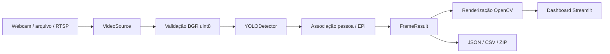

# Arquitetura e contratos

`VideoSource` é um context manager e libera recursos mesmo quando a inferência
falha. Arquivos terminam em EOF; desconexões e vídeos sem frames geram
`CaptureError`. Streams FFmpeg usam timeout de abertura/leitura de 5 s.
Webcams dependem do driver do sistema; alguns drivers podem bloquear além
desse limite. Reconexão é explícita pelo botão Iniciar.

`preprocess_frame` valida dimensões, canais BGR e dtype uint8 e garante memória
contígua. Resize/letterbox/normalização ficam no backend Ultralytics, que também
restaura as caixas às coordenadas originais. Não há letterbox duplicado.

`YOLODetector` carrega uma vez por sessão e transforma resultados de qualquer
backend em `Detection(class_id, label, confidence, bbox)`. A biblioteca é
carregada tardiamente. Ausência de GPU permite CPU nos formatos compatíveis;
TensorRT exige CUDA. Pesos inexistentes não provocam downloads implícitos.

`Pipeline` coordena inferência, contagens e regras, sem importar Streamlit ou
capturar vídeo. `FrameResult` contém frame original, detecções, contagens,
alertas, índice e tempos medidos. `render_frame` cria uma cópia anotada.

## Hardware

| Artefato | Seleção automática |
| --- | --- |
| PyTorch `.pt` | CUDA → MPS → CPU |
| ONNX | CUDA quando PyTorch CUDA e ONNX Runtime GPU estão disponíveis; senão CPU |
| OpenVINO | CPU; foco em portabilidade |
| TensorRT `.engine` | CUDA obrigatório; erro explicativo sem NVIDIA |

O extra ONNX inclui `onnxruntime` CPU. Para NVIDIA substitua-o por
`onnxruntime-gpu` compatível com CUDA/cuDNN; não instale ambos no mesmo ambiente.
MPS usa `.pt`; não é backend de ONNX. Falha de acelerador durante inferência
pode reconstruir o adaptador em CPU para formatos compatíveis.

## Regras de EPI

Classes reconhecidas por nome normalizado, nunca por IDs COCO fixos:

- Pessoa: person, people, pessoa, pessoas, worker, trabalhador.
- Capacete: helmet, hardhat, hard hat, safety helmet, capacete, capacete de segurança.
- Colete: vest, safety vest, reflective vest, colete, colete refletivo, colete de segurança.

Classes negativas (`NO-Hardhat`, `no_helmet`) não contam como EPI presente.
Em modo EPI, classes positivas de pessoa/capacete/colete são necessárias;
modelos incompatíveis exibem análise indisponível.

Cada capacete/colete é associado a no máximo uma pessoa pelo centro e região
anatômica aproximada. Pessoas sobrepostas, oclusões e equipamentos fora do campo
podem gerar falsas ausências. Alertas são sugestões para revisão visual, por
frame. Não há rastreamento de identidade nem confirmação temporal nesta versão;
“Pessoa 1” é a ordem espacial no frame, não uma identidade persistente. Botas
são contadas quando o modelo as detecta, mas não entram na regra atual.

## Sessão e métricas

O dashboard processa um frame por execução de `st.fragment` a cada 0,1 s. Os
sliders são lidos em cada frame; Iniciar/Parar não dependem de loop infinito.
A exibição é limitada a aproximadamente 10 FPS e arquivos são lidos
sequencialmente na velocidade de processamento, sem garantia de reprodução
na taxa original. Isso não limita o benchmark da CLI. RTSP pode acumular
latência em buffers do driver/backend; meça ponta a ponta no ambiente real.

Cada sessão possui modelo/captura próprios, sem cache global de câmera. Um
watchdog libera recursos após aproximadamente 45–50 s de inatividade. Ao
encerrar use Parar; um driver nativo bloqueado pode atrasar a liberação.

Histórico em memória limitado a 300 frames; sem vídeo bruto acumulado. O ZIP
inclui JSON, CSV e último snapshot. Contagens acumuladas representam ocorrências
de detecção por frame, não pessoas únicas. Credenciais de RTSP ficam fora dos
metadados. A prévia sintética exporta `mode=illustrative_preview` e não atribui
confiança ou latência de modelo aos desenhos.

## Referências de implementação

- [Ultralytics 8.3.203 — código do exportador](https://github.com/ultralytics/ultralytics/blob/v8.3.203/ultralytics/engine/exporter.py)
- [Streamlit — fragment](https://docs.streamlit.io/develop/api-reference/execution-flow/st.fragment)
- [Ultralytics — validação e gráficos](https://docs.ultralytics.com/modes/val/)
