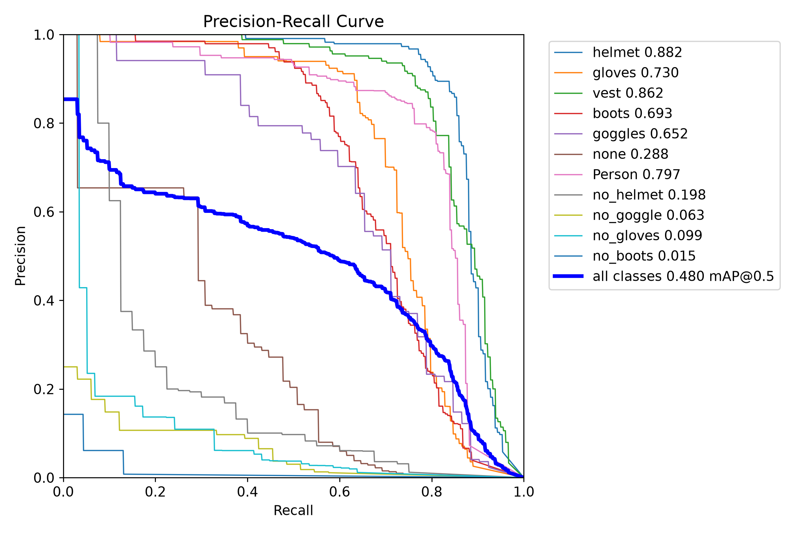
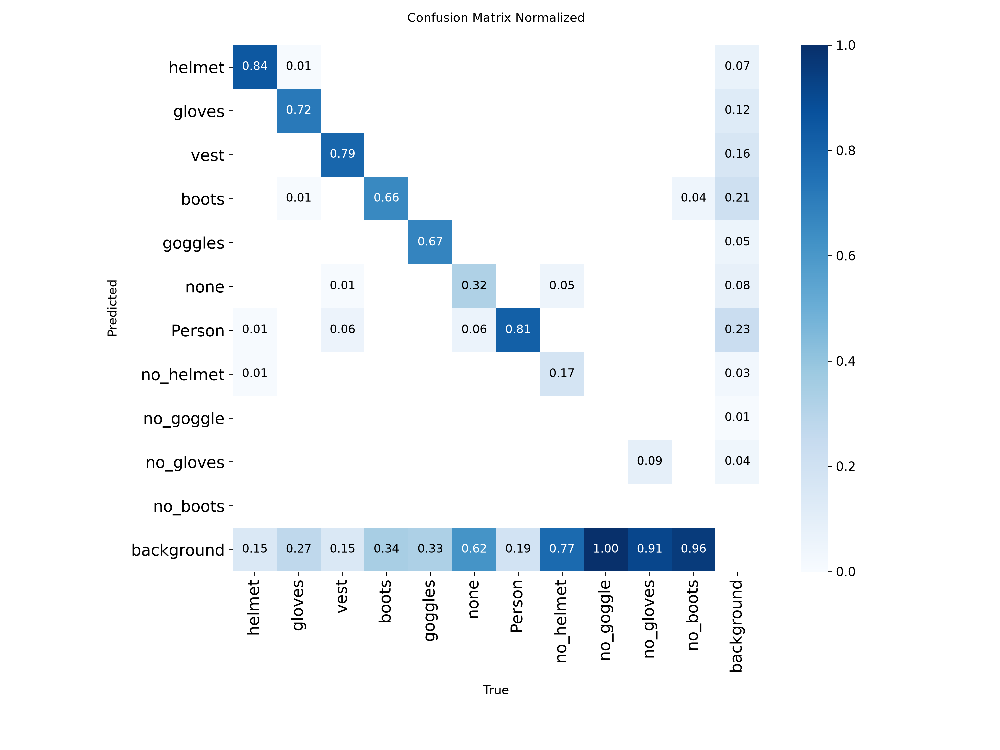

# Validação executada

## Núcleo do TCC: treino e detecção real — 23/09/2026

A revisão dos dois documentos fornecidos está em [TCC_ALIGNMENT.md](TCC_ALIGNMENT.md).
O foco passou para dois modelos de detecção, com interface simples. Foi executado
treinamento real de **YOLO11n para EPI**, além do detector COCO de pessoas.
Isso não reproduz YOLOv5 nem comprova o mAP 0,841 citado no artigo.

**Artefatos desta instalação:** `models/ppe/best.pt` e
`models/ppe/best_int8_openvino_model/`. Pesos e dados estão ignorados pelo Git;
a reprodução em outro computador exige o preparo e treino descritos em [ML.md](ML.md).
O [relatório compacto do experimento](experiments/ppe-2026-09-23.json)
preserva configurações, hashes, métricas por classe e limitações; o
[histórico das épocas](experiments/training-2026-09-23.csv) também está versionável.

### Dados e protocolo

- Construction-PPE: **1.132 imagens de treino, 143 de validação, 141 de teste**,
  com 11 classes e 11.521 instâncias anotadas no total.
- Auditoria: 1.416 imagens legíveis, sem rótulos ausentes e sem cópias idênticas
  entre splits. Não verifica similaridade visual, qualidade semântica ou
  independência por pessoa/câmera. A inspeção encontrou inclusive cenas fora
  de obra; a base requer curadoria antes de representar o cenário do TCC.
- Treino: YOLO11n inicializado com COCO, **10 épocas, imgsz 416, batch 8,
  seed 42, CPU, AMP desativado**. Cerca de 74 minutos nesta máquina.
  O melhor checkpoint foi escolhido pelo val; dez épocas não comprovam convergência.
- Teste do detector individual: 141 imagens, imgsz 640, batch 1,
  confidence 0,001, IoU de NMS 0,7. Nenhuma imagem do teste foi usada para
  treinar ou calibrar esta execução local.
- O teste foi consultado anteriormente para diagnosticar o candidato público
  descartado. Portanto, esta comparação é **exploratória**, não um experimento
  confirmatório cego. A auditoria tampouco comprova independência do pré-treino COCO.

### Detector individual de EPI

| Escopo/classe | mAP@0,5 PyTorch | mAP@0,5 INT8 |
| --- | --- | --- |
| Todas as 11 classes | **0,4799** | **0,4768** |
| Capacete | 0,8816 | 0,8962 |
| Colete | 0,8619 | 0,8766 |
| Sem capacete | **0,1980** | **0,1758** |

O mAP@0,5:0,95 global foi 0,2244 (PyTorch) e 0,2276 (INT8).
Resultados bons nas classes positivas não validam a detecção de infrações.
As métricas completas das outras classes estão no JSON; não foram removidas
da média global. `no_vest` não existe neste dataset: colete não detectado
permanece inconclusivo, sem inferir ausência.





Arquivos completos: `runs/validate/ppe_tcc_test/validation.json`,
`BoxPR_curve.png`, `confusion_matrix.png`, `predictions.json` e equivalentes
em `runs/validate/ppe_tcc_int8_test/`. As curvas são do detector individual,
não da associação pessoa/EPI nem da regra temporal de alertas.

### Cascata completa: pessoa → EPI

Mesmas 141 imagens, ambos os modelos com imgsz 640, confiança 0,40,
NMS IoU 0,45 e correspondência com anotação em IoU 0,50:

| Classe | TP | FP | FN | Precisão | Recall |
| --- | --- | --- | --- | --- | --- |
| Pessoa | 186 | 51 | 50 | 78,48% | 78,81% |
| Capacete | 153 | 8 | 39 | 95,03% | 79,69% |
| Colete | 139 | 8 | 39 | 94,56% | 78,09% |
| Sem capacete | **5** | **1** | **35** | 83,33% | **12,50%** |

Esses resultados são **precisão/recall de caixas com limiar fixo, não mAP**.
O modelo externo YOLOv8n previamente avaliado encontrou apenas 1/178 coletes
nessas condições, contra 139/178 do treino local. Essa comparação de candidatos
não isola arquitetura: os dados de treinamento são diferentes. Não demonstra
superioridade de YOLO11 sobre YOLOv8 ou YOLOv5.

**Limitação principal:** 35 dos 40 casos anotados de ausência de capacete
foram omitidos. Não usar o sistema como fiscalização automática. Ainda é
necessário anotar estados/associações por pessoa e cenas temporais para medir
falsos alertas, omissões e resultados inconclusivos do sistema completo.

Relatórios detalhados: `runs/tcc-review/cascade-trained-test.json`,
`cascade-int8-test.json` e `cascade-public-test.json`; incluem erros por imagem.

### Quantização e velocidade

OpenVINO INT8 foi calibrado com **dados de treino apenas**. O YAML específico
`data/construction-ppe-calibration.yaml` aponta o campo `val` exigido pelo
exportador para `images/train`. A fração 0,3 disponibilizou 340 imagens;
o NNCF coletou estatísticas de 300. O artefato tem aproximadamente 3,2 MB.
A redução de mAP@0,5 global foi de 0,31 ponto percentual neste teste.
O backend estático pode usar padding diferente do PyTorch; a comparação
não isola exclusivamente a quantização.

Benchmark sequencial na CPU Intel i7-1355U, mesma cena pública repetida,
40 quadros medidos após 10 aquecimentos. O EPI executou em todos os 40 quadros;
apenas o segundo modelo foi substituído por INT8:

| Cascata | Captura + processamento + desenho, média | p95 | FPS equivalente |
| --- | --- | --- | --- |
| Pessoa PyTorch + EPI PyTorch | 284,9 ms | 378,1 ms | 3,51 |
| Pessoa PyTorch + EPI INT8 | 247,9 ms | 277,8 ms | 4,03 |

É uma medição curta de integração, com leitura e decodificação do vídeo,
sem UI, gravação de relatórios/snapshots, rede ou carregamento dos modelos.
Não promete FPS em operação. Relatórios com tempos por estágio:
`runs/tcc-review/benchmark-pt.json` e `benchmark-int8.json`.
Reproduza com `benchmark --ppe-model ...` conforme [ML.md](ML.md).

### Execução funcional e testes

- Imagem real `image1010.jpg`, primeira do val em ordem alfabética: pessoa,
  capacete e colete detectados; resultado em [ppe-detection.jpg](images/ppe-detection.jpg).
- Vídeo de integração: 32 quadros; 2 vazios pularam o EPI e 30 executaram
  ambos os modelos, sem ocorrência de ausência de EPI.
- Cinco imagens escolhidas pelas previsões de classe negativa exercitaram
  gravação real: duas geraram ocorrência e três permaneceram inconclusivas.
  Essa seleção testa integração, não qualidade estatística ou contexto de obra.
- Uma dessas cenas repetida em vídeo gerou uma ocorrência após 2 segundos
  da mídia, com JPEG/JSON e câmera/local em diretório isolado. Não há garantia
  de que EPI seja obrigatório no ambiente retratado pela imagem pública.
- **Nenhum envio real ao Telegram/Outlook**, acesso a webcam física ou RTSP
  foi usado nesses testes. Transporte externo continua opt-in.

Regressão final em **24/09/2026: 428 testes passaram em 12,50 s**, sem falhas.
`pip check` não encontrou incompatibilidades e `compileall src scripts tests`
terminou sem erro. Registros estão no relatório do experimento;
os logs completos ficam em `runs/tcc-review/pytest-final-console.log`.
Os testes simulam GPU, câmera e transporte; AppTest executa Streamlit de verdade.

Próximas evidências necessárias para o TCC: dados coletados no ambiente real,
negativos de capacete/colete bem anotados, splits por sessão/câmera, comparação
com YOLOv5 e avaliação de alertas por pessoa ao longo do tempo. O mapa de
aderência também registra Metabase/N8N/Next e revisão humana ainda pendentes.

## Histórico de verificações anteriores

As seções seguintes descrevem a base e a demonstração COCO antes do treino de EPI.

## Extensão de ocorrências e alertas — 21/09/2026

Executada no mesmo ambiente CPU descrito abaixo, com Requests 2.34.2 e
Pillow 11.3.0 explicitados nas dependências.

| Verificação | Resultado |
| --- | --- |
| `python -m pytest -q -p no:cacheprovider` | **190 passed in 9.03s** |
| `python -m pip check` e `compileall` | Dependências consistentes; código compilado |
| Streamlit AppTest | 8 testes: prévia isolada, configurações sem segredos em disco, detecção e ocorrência com Telegram simulado, captura manual, falha de disco e botão de teste |
| Ocorrências | Confirmação por continuidade espacial, cooldown, gravação atômica, retenção protegendo pendentes, falha de limpeza sem invalidar gravação, rejeição de metadados malformados |
| Telegram / SMTP | 52 testes com mocks; payload da foto, TLS/OAuth2, erros sem credenciais, fila e encerramento |
| Navegador com YOLO11n CPU | Vídeo `runs/smoke/sample.avi`: 35 frames processados; último frame com 4 pessoas e 1 ônibus; ocorrência automática JPEG/JSON com câmera/local consultada na interface |

A sessão de navegador usou armazenamento isolado em
`runs/smoke-alerts/reports`, com todos os canais externos desativados.
Prints: `images/detections.png` e `images/telegram.png`. O vídeo contém a cena
`bus.jpg` repetida, conforme o script de smoke abaixo. Confirmação e horário
correspondem à análise, não à duração ou ao horário original de uma filmagem.

**Não houve envio real pelo Telegram ou SMTP.** A conexão com o bot/chat do
usuário e a autenticação OAuth2 de uma conta Outlook precisam ser exercitadas
com as credenciais do operador. Login Microsoft e renovação automática do token
não fazem parte desta versão. Aceitação pela API/SMTP não prova entrega/leitura.

## Validação da base — 18/09/2026

Execução local em **18/09/2026**, Windows 11, Intel Core i7-1355U, CPU,
Python 3.12.14. PyTorch 2.8.0 CPU, torchvision 0.23.0, Ultralytics 8.3.203,
OpenCV 4.12.0.88, NumPy 2.2.6, Streamlit 1.49.1, ONNX 1.17.0,
ONNX Runtime 1.22.1, OpenVINO 2025.4.1 e NNCF 2.19.0.

## Resultados

| Verificação | Evidência |
| --- | --- |
| `python -m pytest -q -p no:cacheprovider` | **82 passed** |
| `python -m pip check` | Nenhuma dependência incompatível |
| Compilação `compileall` | Código Python compilado sem erro |
| `run.py --install-only` e segunda execução | Instalação editável e reutilização do ambiente aprovadas |
| Streamlit AppTest | Iniciar, alterar confiança/IoU, preparar PNG/ZIP, parar e liberar recursos; upload ausente tratado |
| Navegador | Prévia ilustrativa em funcionamento; print em `images/dashboard.png` |
| YOLO11n PyTorch CPU | 8 frames de vídeo processados; pessoa/ônibus detectados; JSONL e snapshot gravados |
| Exportação ONNX FP32 e inferência CPU | Artefato exportado; 8 frames processados com as mesmas contagens do PyTorch na fixture |
| Resolução estática ONNX | Exportação 320, solicitação 640, 3 inferências consecutivas e validação adotaram 320 corretamente |
| Validação real da API | PNGs de matriz de confusão e curvas PR/F1/P/R, predições JSON, matriz/curvas numéricas em JSON |
| OpenVINO INT8 | Exportação com calibração de fixture e duas inferências CPU consecutivas aprovadas |
| Tratamento de falhas | Testes de modelo/dependência ausente, fallback, frame inválido, desconexão, EOF, corrupção e classes EPI incompatíveis |

Os testes automatizados usam mocks para GPU/câmera e não baixam pesos nem
enviam mensagens externas. Os testes AppTest exercitam Streamlit de verdade.
As execuções de integração usam pesos COCO oficiais baixados explicitamente.

## Alcance das integrações

`scripts/smoke.py` cria um vídeo MJPG com a imagem `bus.jpg` incluída na
Ultralytics, executa PyTorch/ONNX, snapshots e benchmark. É uma verificação de
integração, não um dataset de detecção de EPI. Na execução de 20 frames após 3
warmups, o tempo captura + pipeline + desenho ficou em aproximadamente:

| Backend CPU | Média | p95 | FPS equivalente |
| --- | --- | --- | --- |
| PyTorch | 74,6 ms | 109,3 ms | 13,4 |
| ONNX Runtime | 51,8 ms | 56,0 ms | 19,3 |

Uma cena repetida e uma amostra curta não sustentam promessa de desempenho.
Os números excluem UI/disco e variam com energia, carga, resolução e conteúdo.
Relatórios originais estão em `runs/smoke/benchmark-*.json`, ignorados pelo Git.
O script permite reproduzir as medições no computador de destino.

`scripts/smoke_validation.py --int8` usa seis cópias da imagem e um rótulo
aproximado, exclusivamente para conferir o contrato das APIs. O exportador
avisou que a calibração tem menos de 300 imagens recomendadas. Os gráficos e
valores mAP dessa fixture não devem ser apresentados como resultados do TCC.
O artefato fica isolado em `runs/smoke-validation/smoke_only_int8_openvino_model`
e não é modelo de EPI pronto para uso. A integração terminou com sucesso,
mesmo com o aviso NNCF de preferência por PyTorch 2.9; a versão usada foi 2.8.

## Pendências registradas na validação da base (18/09)

- A etapa pública de treino, mAP e calibração INT8 foi executada em 23/09,
  conforme os resultados acima; coleta in loco e comparação de arquiteturas continuam pendentes.
- GPU NVIDIA, TensorRT, CUDA e Apple MPS: seleção/falhas cobertas por mocks,
  mas não executadas em hardware real nesta máquina.
- Webcam física, RTSP e reconexão com os drivers/câmeras da demonstração.
- Build/execução Docker e CI nos três sistemas: arquivos preparados; Docker
  não está instalado neste ambiente e os jobs remotos não foram executados.
- Setup limpo em uma máquina sem ambiente existente: o inicializador foi
  exercitado no ambiente local, com instalação editável e reutilização.

O Python global desta máquina aponta para o atalho da Microsoft Store. Para
executar imediatamente a cópia já preparada, na raiz do repositório use:

```powershell
.\.venv\Scripts\python.exe run.py
```

Durante testes, o sandbox Windows restringiu ACLs de diretórios temporários do
pytest/Streamlit. As execuções finais ocorreram com as permissões necessárias;
nenhuma alteração de segurança do sistema foi exigida pelo produto.
