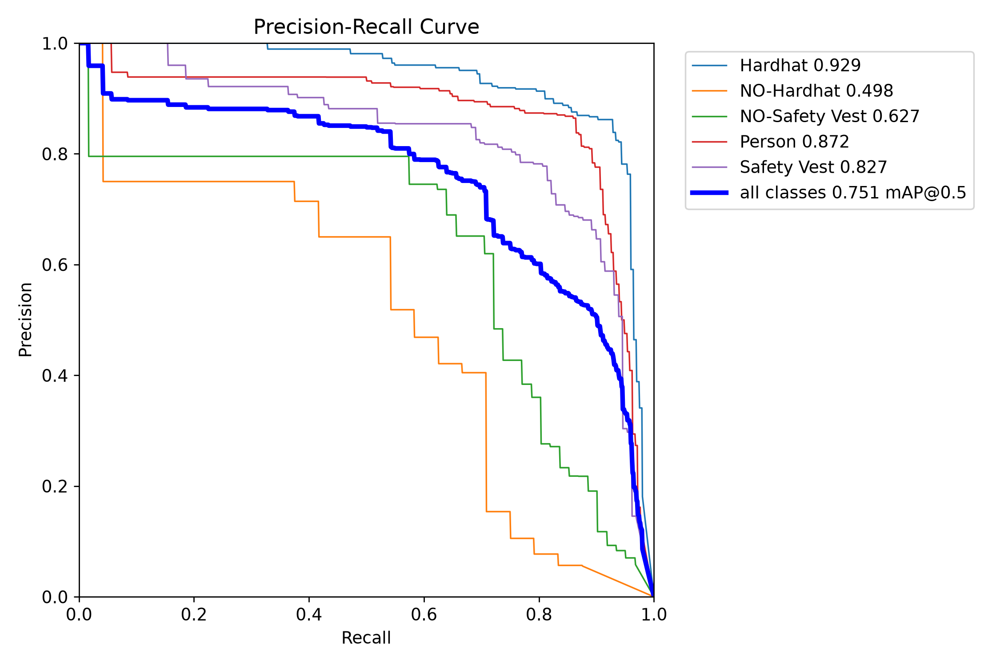
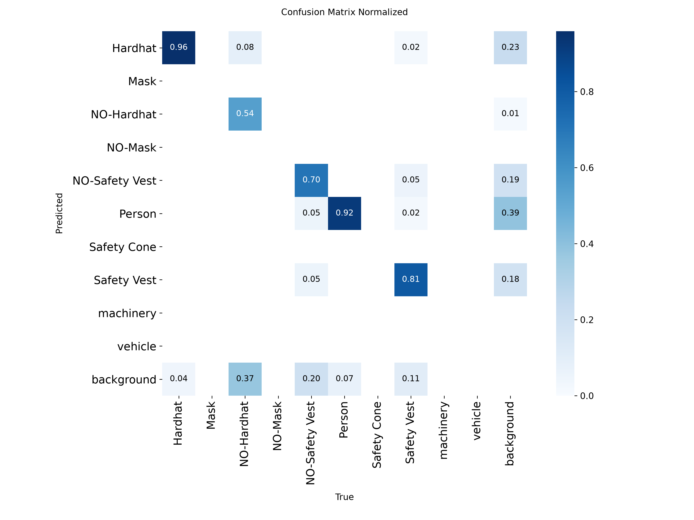
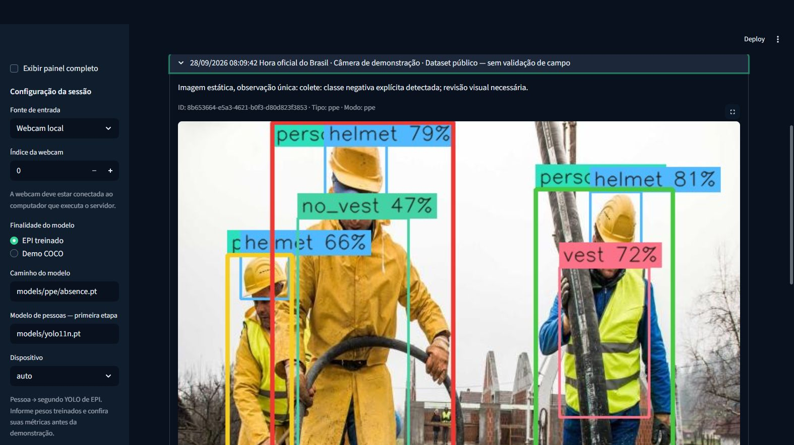
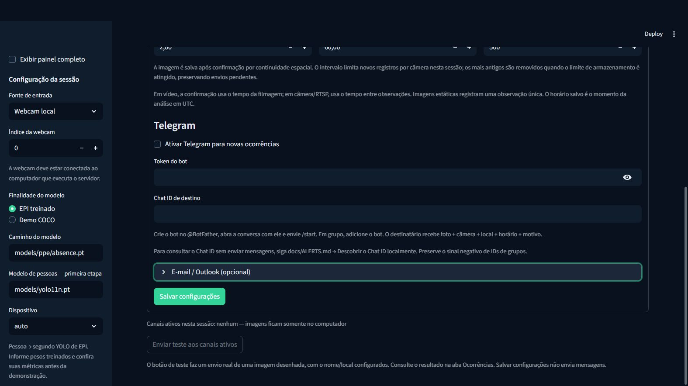
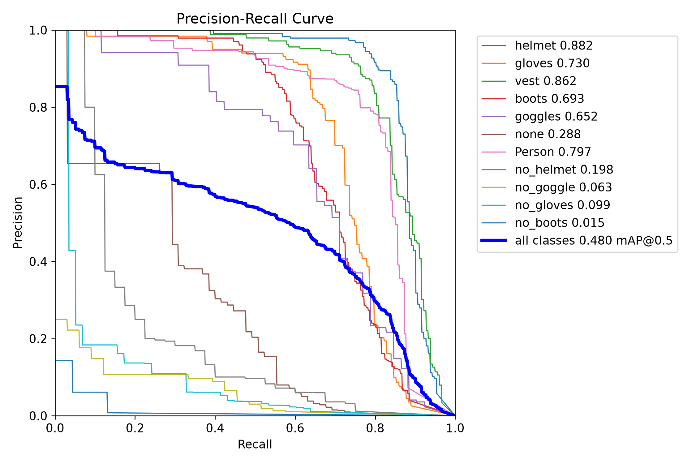
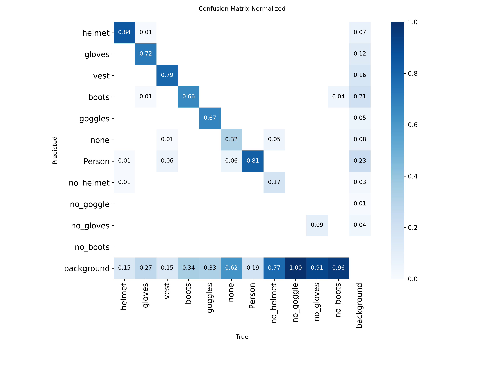

# Validação executada

## Revisão atual: desempenho e apresentação — 29/09/2026

O perfil **CPU otimizada (OpenVINO)** usa os dois modelos exportados em
**640, FP32**, disponíveis nesta instalação. A interface o recomenda em CPU
quando os artefatos e o runtime estão presentes; CUDA/MPS ou instalações sem
OpenVINO permanecem no perfil PyTorch. Os exports FP32 não são quantização INT8.

A repetição da cascata em **119 imagens de validação e 90 de teste** manteve
os mesmos TP, FP e FN do modelo nativo nos limiares operacionais. O detector
individual OpenVINO também foi reavaliado, com curvas PR e matriz de confusão:
mAP@0,5 **0,7592**, média das cinco classes anotadas. Repetir esses dados verifica
regressões, sem constituir um novo teste independente.

No benchmark local da cascata, **3,49 FPS com PyTorch original passaram a
7,31 FPS com OpenVINO**, sem captura, interface, gravação ou rede. **25–30 FPS
reais não foram atingidos**. A prévia foi estabilizada em uma área 16:9 e o
limite de análises por segundo permite controlar a carga; ele não garante FPS.

Em **30/09**, uma comparação A/B da interface com o mesmo vídeo de 103 quadros
mediu **5,43 → 7,57 FPS** após desativar a coleta completa forçada por atualização
do Streamlit. A coleta normal do Python permanece ativa. Os relatórios exportados
mostram caixas, scores e decisões idênticos nos 103 quadros. Essa comparação
curta não substitui ensaio prolongado de memória nem validação com câmera real.

**558 testes passaram em 22,25 s**; `pip check`, `compileall` e
`run.py --install-only --no-download` concluíram sem erros. O modelo ativo e
a associação por pessoa cobrem capacete/colete, **sem suporte a botas**.
Continuam pendentes a melhoria de ausências, a validação no ambiente real e
os testes com webcam/RTSP e o bot do operador. O protótipo pode ser apresentado
com essas limitações, sem prometer cobertura de botas ou fiscalização automática.

Configuração, métricas por classe, artefatos e pendências estão na
[revisão para apresentação](PRESENTATION_CHECK.md). As seções abaixo preservam
o histórico datado das medições anteriores.

## Capacete, colete e ausências explícitas — 28/09/2026

O modelo ativo passou a ser **`models/ppe/absence.pt`**, SHA256
`14ac39c777e94864006bf5842a941c00e1b50a7b21f60e3b676d4beab6949d0b`.
O detector COCO de pessoas permanece o mesmo. `models/ppe/best.pt` e seu INT8
foram preservados como experimento anterior: **não são exports do modelo novo**.

O novo ajuste habilita **sem colete** e melhora algumas métricas, mas **não resolve
a baixa detecção de sem capacete**. Também houve regressão de colete no dataset
anterior. As medidas abaixo preservam esses resultados, sem apresentar o sistema
como validado para fiscalização ou para o ambiente real do TCC.

Artefatos versionáveis: [relatório do experimento](experiments/ppe-absence-2026-09-28.json),
[histórico das épocas](experiments/absence-training-2026-09-24.csv),
[procedência e reprodução](ABSENCE_DATA.md). Relatórios detalhados e erros por
imagem ficam em `runs/ppe-absence/` nesta instalação.

### Dados, treinamento e seleção

- RF100 `construction-safety-gsnvb`, preservando **997 imagens de treino,
  119 de validação e 90 de teste**. As 1.206 imagens foram lidas e auditadas,
  com 7.724 instâncias, sem arquivos de rótulos ausentes ou duplicatas exatas
  entre splits. Isso não certifica a qualidade semântica das anotações.
- Cinco classes anotadas: capacete, sem capacete, sem colete, pessoa e colete.
  Os rótulos foram remapeados para os IDs do modelo externo YOLO11n, preservando
  suas dez saídas. As outras cinco classes **não foram avaliadas**.
- Ajuste local concluído em **24/09**: 10 épocas, imgsz 416, batch 8, seed 42,
  CPU, AMP desativado e `freeze=10`. Aproximadamente 36,5 minutos de épocas.
  O melhor checkpoint foi escolhido pelo val; esse prazo não comprova convergência.
- Há apenas **94 instâncias de sem capacete no treino**, contra 2.116 capacetes.
  A inspeção encontrou inclusive uma anotação `no-vest` sobre um capacete no val
  (`ppe_0441`). O exemplo permaneceu intacto e está registrado no protocolo.
- Comparação de candidatos em val antes do teste, mantendo o mesmo detector de
  pessoas, imgsz 640, confiança 0,40, NMS IoU 0,45 e matching IoU 0,50.
  Nenhum limiar foi ajustado a partir dos resultados de teste.
- O teste ficou fora do **ajuste local**, mas a sobreposição com os dados usados
  pelo autor dos pesos externos é desconhecida. Não é prova de teste independente.

### Comparação no mesmo val: 119 imagens

Valores de recall de caixas da cascata com limiar fixo, não mAP:

| Classe | Modelo anterior | Candidato externo | Ajuste local selecionado | Precisão do ajuste |
| --- | --- | --- | --- | --- |
| Capacete | 68,53% (159/232) | 73,71% (171/232) | 88,79% (206/232) | 91,96% |
| Colete | 75,89% (107/141) | 79,43% (112/141) | 81,56% (115/141) | 94,26% |
| Sem capacete | 0% (0/11) | 27,27% (3/11) | 45,45% (5/11) | 100% (5 TP, 0 FP) |
| Sem colete | Classe inexistente | 55,56% (50/90) | 63,33% (57/90) | 83,82% |

São apenas 11 exemplos de sem capacete no val; 100% de precisão com cinco
previsões não garante precisão equivalente em outras cenas. Os três modelos
usam dados de treino diferentes, portanto a comparação não isola arquitetura.

### Resultado do modelo selecionado no teste RF100: 90 imagens

Mesmos limiares da tabela anterior, sem mudar a geometria de associação:

| Classe | TP | FP | FN | Precisão | Recall |
| --- | --- | --- | --- | --- | --- |
| Pessoa | 186 | 44 | 28 | 80,87% | 86,92% |
| Capacete | 178 | 30 | 17 | 85,58% | 91,28% |
| Colete | 93 | 15 | 36 | **86,11%** | **72,09%** |
| Sem capacete | 6 | 3 | 18 | 66,67% | **25,00%** |
| Sem colete | 39 | 17 | 22 | **69,64%** | **63,93%** |

As 18 omissões de sem capacete e 22 omissões de sem colete continuam sendo
limitações materiais. Os 17 falsos positivos de sem colete também exigem atenção.
Esses números avaliam **caixas**, não a classificação final por pessoa nem os
alertas temporais. Não detectar uma caixa continua gerando incerteza, nunca uma
classe negativa inventada. Relatório: `runs/ppe-absence/finetuned-test.json`.

O detector individual de EPI foi avaliado separadamente em imgsz 640,
batch 1, confiança 0,001 e NMS IoU 0,7. mAP@0,5 **0,7506** e mAP@0,5:0,95
**0,3949**, média das **cinco classes anotadas**, não das dez saídas. AP@0,5
por classe: capacete 0,9291; colete 0,8274; sem capacete 0,4984;
sem colete 0,6265; pessoa 0,8716. A saída de pessoa desse segundo modelo
não substitui o primeiro detector na cascata. Não confundir AP com recall
no limiar operacional de 0,40.





Arquivos completos: `runs/validate/ppe_absence_test/validation.json`,
`BoxPR_curve.png`, `confusion_matrix.png` e `predictions.json`.

### Regressão exploratória no teste anterior: 141 imagens Construction-PPE

Para comparar diretamente com o recall de 12,5% citado anteriormente,
o novo modelo também foi executado no mesmo teste antigo, mantendo limiares:

| Classe | Anterior TP / FP / FN | Novo TP / FP / FN | Recall anterior → novo | Precisão anterior → nova |
| --- | --- | --- | --- | --- |
| Capacete | 153 / 8 / 39 | 153 / 12 / 39 | 79,69% → 79,69% | 95,03% → 92,73% |
| Colete | 139 / 8 / 39 | 126 / 11 / 52 | 78,09% → 70,79% | 94,56% → 91,97% |
| Sem capacete | 5 / 1 / 35 | 10 / 13 / 30 | **12,50% → 25,00%** | **83,33% → 43,48%** |

O aumento de recall de sem capacete veio acompanhado de mais falsos positivos.
Houve perda de detecção de coletes nesse domínio. Não há ganho universal nem
conclusão de que a ausência esteja resolvida. Esse teste foi consultado em
experimentos anteriores e é um diagnóstico exploratório de regressão.
Não contém `no_vest` e não mede essa classe. Relatório:
`runs/ppe-absence/finetuned-construction-test.json`.

### Interface, evidências e Telegram

A visualização simples separa **Capacete / Colete** por pessoa e mantém três
estados. A imagem pública `ppe_0079` foi selecionada para testar o fluxo: uma
pessoa com EPIs, uma com ausência explícita de colete e uma inconclusiva.
O colete da pessoa à esquerda não foi reconhecido; a interface preservou
a incerteza. [Foto e atribuição](../README.md).

A execução real pelo navegador salvou JPEG/JSON no histórico com câmera e local,
em diretório isolado `runs/ppe-absence/ui-reports/occurrences/`.





Um vídeo **artificial de integração**, repetindo a cena por 100 quadros e
acrescentando três quadros vazios a 25 FPS, gerou exatamente uma ocorrência:
frame 51, **2,00 segundos da mídia**, sem duplicação durante cooldown de 60 s.
Os três quadros vazios pularam o segundo YOLO. Não é validação temporal em obra.
Relatório: `runs/ppe-absence/smoke/smoke-summary.json`.

**Nenhum envio real ao Telegram/Outlook**, webcam física ou RTSP foi usado.
O Telegram foi exercitado por mocks (incluindo foto/local/motivo), e os campos
foram conferidos no navegador; a conexão com o bot do operador permanece pendente.
O [guia de alertas](ALERTS.md) explica token, Chat ID, ativação e consulta dos envios.

Verificação final em 28/09/2026: **504 testes passaram em 27,24 s**;
`pip check`, `compileall src scripts tests` e `git diff --check` sem erros.
Naquela data, o novo modelo ainda não tinha export quantizado validado; os
resultados INT8 abaixo pertencem exclusivamente ao experimento anterior.
Em 29/09, foram validados os exports OpenVINO **FP32**, conforme a revisão acima;
a quantização INT8 do modelo novo continua pendente.

## Núcleo do TCC: treino e detecção real — 23/09/2026

A revisão dos dois documentos fornecidos está em [TCC_ALIGNMENT.md](TCC_ALIGNMENT.md).
O foco passou para dois modelos de detecção, com interface simples. Foi executado
treinamento real de **YOLO11n para EPI**, além do detector COCO de pessoas.
Isso não reproduz YOLOv5 nem comprova o mAP 0,841 citado no artigo.

**Artefatos desta instalação:** `models/ppe/best.pt` e
`models/ppe/best_int8_openvino_model/`. Pesos e dados estão ignorados pelo Git;
a reprodução em outro computador exige o preparo e treino descritos em [ML.md](ML.md).
O [relatório compacto do experimento](experiments/ppe-2026-09-23.json)
preserva configurações, hashes, métricas por classe e limitações; o
[histórico das épocas](experiments/training-2026-09-23.csv) também está versionável.

### Dados e protocolo

- Construction-PPE: **1.132 imagens de treino, 143 de validação, 141 de teste**,
  com 11 classes e 11.521 instâncias anotadas no total.
- Auditoria: 1.416 imagens legíveis, sem rótulos ausentes e sem cópias idênticas
  entre splits. Não verifica similaridade visual, qualidade semântica ou
  independência por pessoa/câmera. A inspeção encontrou inclusive cenas fora
  de obra; a base requer curadoria antes de representar o cenário do TCC.
- Treino: YOLO11n inicializado com COCO, **10 épocas, imgsz 416, batch 8,
  seed 42, CPU, AMP desativado**. Cerca de 74 minutos nesta máquina.
  O melhor checkpoint foi escolhido pelo val; dez épocas não comprovam convergência.
- Teste do detector individual: 141 imagens, imgsz 640, batch 1,
  confidence 0,001, IoU de NMS 0,7. Nenhuma imagem do teste foi usada para
  treinar ou calibrar esta execução local.
- O teste foi consultado anteriormente para diagnosticar o candidato público
  descartado. Portanto, esta comparação é **exploratória**, não um experimento
  confirmatório cego. A auditoria tampouco comprova independência do pré-treino COCO.

### Detector individual de EPI

| Escopo/classe | mAP@0,5 PyTorch | mAP@0,5 INT8 |
| --- | --- | --- |
| Todas as 11 classes | **0,4799** | **0,4768** |
| Capacete | 0,8816 | 0,8962 |
| Colete | 0,8619 | 0,8766 |
| Sem capacete | **0,1980** | **0,1758** |

O mAP@0,5:0,95 global foi 0,2244 (PyTorch) e 0,2276 (INT8).
Resultados bons nas classes positivas não validam a detecção de infrações.
As métricas completas das outras classes estão no JSON; não foram removidas
da média global. `no_vest` não existe neste dataset: colete não detectado
permanece inconclusivo, sem inferir ausência.





Arquivos completos: `runs/validate/ppe_tcc_test/validation.json`,
`BoxPR_curve.png`, `confusion_matrix.png`, `predictions.json` e equivalentes
em `runs/validate/ppe_tcc_int8_test/`. As curvas são do detector individual,
não da associação pessoa/EPI nem da regra temporal de alertas.

### Cascata completa: pessoa → EPI

Mesmas 141 imagens, ambos os modelos com imgsz 640, confiança 0,40,
NMS IoU 0,45 e correspondência com anotação em IoU 0,50:

| Classe | TP | FP | FN | Precisão | Recall |
| --- | --- | --- | --- | --- | --- |
| Pessoa | 186 | 51 | 50 | 78,48% | 78,81% |
| Capacete | 153 | 8 | 39 | 95,03% | 79,69% |
| Colete | 139 | 8 | 39 | 94,56% | 78,09% |
| Sem capacete | **5** | **1** | **35** | 83,33% | **12,50%** |

Esses resultados são **precisão/recall de caixas com limiar fixo, não mAP**.
O modelo externo YOLOv8n previamente avaliado encontrou apenas 1/178 coletes
nessas condições, contra 139/178 do treino local. Essa comparação de candidatos
não isola arquitetura: os dados de treinamento são diferentes. Não demonstra
superioridade de YOLO11 sobre YOLOv8 ou YOLOv5.

**Limitação principal:** 35 dos 40 casos anotados de ausência de capacete
foram omitidos. Não usar o sistema como fiscalização automática. Ainda é
necessário anotar estados/associações por pessoa e cenas temporais para medir
falsos alertas, omissões e resultados inconclusivos do sistema completo.

Relatórios detalhados: `runs/tcc-review/cascade-trained-test.json`,
`cascade-int8-test.json` e `cascade-public-test.json`; incluem erros por imagem.

### Quantização e velocidade

OpenVINO INT8 foi calibrado com **dados de treino apenas**. O YAML específico
`data/construction-ppe-calibration.yaml` aponta o campo `val` exigido pelo
exportador para `images/train`. A fração 0,3 disponibilizou 340 imagens;
o NNCF coletou estatísticas de 300. O artefato tem aproximadamente 3,2 MB.
A redução de mAP@0,5 global foi de 0,31 ponto percentual neste teste.
O backend estático pode usar padding diferente do PyTorch; a comparação
não isola exclusivamente a quantização.

Benchmark sequencial na CPU Intel i7-1355U, mesma cena pública repetida,
40 quadros medidos após 10 aquecimentos. O EPI executou em todos os 40 quadros;
apenas o segundo modelo foi substituído por INT8:

| Cascata | Captura + processamento + desenho, média | p95 | FPS equivalente |
| --- | --- | --- | --- |
| Pessoa PyTorch + EPI PyTorch | 284,9 ms | 378,1 ms | 3,51 |
| Pessoa PyTorch + EPI INT8 | 247,9 ms | 277,8 ms | 4,03 |

É uma medição curta de integração, com leitura e decodificação do vídeo,
sem UI, gravação de relatórios/snapshots, rede ou carregamento dos modelos.
Não promete FPS em operação. Relatórios com tempos por estágio:
`runs/tcc-review/benchmark-pt.json` e `benchmark-int8.json`.
Reproduza com `benchmark --ppe-model ...` conforme [ML.md](ML.md).

### Execução funcional e testes

- Imagem real `image1010.jpg`, primeira do val em ordem alfabética: pessoa,
  capacete e colete detectados; resultado em [ppe-detection.jpg](images/ppe-detection.jpg).
- Vídeo de integração: 32 quadros; 2 vazios pularam o EPI e 30 executaram
  ambos os modelos, sem ocorrência de ausência de EPI.
- Cinco imagens escolhidas pelas previsões de classe negativa exercitaram
  gravação real: duas geraram ocorrência e três permaneceram inconclusivas.
  Essa seleção testa integração, não qualidade estatística ou contexto de obra.
- Uma dessas cenas repetida em vídeo gerou uma ocorrência após 2 segundos
  da mídia, com JPEG/JSON e câmera/local em diretório isolado. Não há garantia
  de que EPI seja obrigatório no ambiente retratado pela imagem pública.
- **Nenhum envio real ao Telegram/Outlook**, acesso a webcam física ou RTSP
  foi usado nesses testes. Transporte externo continua opt-in.

Regressão final em **24/09/2026: 428 testes passaram em 12,50 s**, sem falhas.
`pip check` não encontrou incompatibilidades e `compileall src scripts tests`
terminou sem erro. Registros estão no relatório do experimento;
os logs completos ficam em `runs/tcc-review/pytest-final-console.log`.
Os testes simulam GPU, câmera e transporte; AppTest executa Streamlit de verdade.

Próximas evidências necessárias para o TCC: dados coletados no ambiente real,
negativos de capacete/colete bem anotados, splits por sessão/câmera, comparação
com YOLOv5 e avaliação de alertas por pessoa ao longo do tempo. O mapa de
aderência também registra Metabase/N8N/Next e revisão humana ainda pendentes.

## Histórico de verificações anteriores

As seções seguintes descrevem a base e a demonstração COCO antes do treino de EPI.

## Extensão de ocorrências e alertas — 21/09/2026

Executada no mesmo ambiente CPU descrito abaixo, com Requests 2.34.2 e
Pillow 11.3.0 explicitados nas dependências.

| Verificação | Resultado |
| --- | --- |
| `python -m pytest -q -p no:cacheprovider` | **190 passed in 9.03s** |
| `python -m pip check` e `compileall` | Dependências consistentes; código compilado |
| Streamlit AppTest | 8 testes: prévia isolada, configurações sem segredos em disco, detecção e ocorrência com Telegram simulado, captura manual, falha de disco e botão de teste |
| Ocorrências | Confirmação por continuidade espacial, cooldown, gravação atômica, retenção protegendo pendentes, falha de limpeza sem invalidar gravação, rejeição de metadados malformados |
| Telegram / SMTP | 52 testes com mocks; payload da foto, TLS/OAuth2, erros sem credenciais, fila e encerramento |
| Navegador com YOLO11n CPU | Vídeo `runs/smoke/sample.avi`: 35 frames processados; último frame com 4 pessoas e 1 ônibus; ocorrência automática JPEG/JSON com câmera/local consultada na interface |

A sessão de navegador usou armazenamento isolado em
`runs/smoke-alerts/reports`, com todos os canais externos desativados.
Prints: `images/detections.png` e `images/telegram.png`. O vídeo contém a cena
`bus.jpg` repetida, conforme o script de smoke abaixo. Confirmação e horário
correspondem à análise, não à duração ou ao horário original de uma filmagem.

**Não houve envio real pelo Telegram ou SMTP.** A conexão com o bot/chat do
usuário e a autenticação OAuth2 de uma conta Outlook precisam ser exercitadas
com as credenciais do operador. Login Microsoft e renovação automática do token
não fazem parte desta versão. Aceitação pela API/SMTP não prova entrega/leitura.

## Validação da base — 18/09/2026

Execução local em **18/09/2026**, Windows 11, Intel Core i7-1355U, CPU,
Python 3.12.14. PyTorch 2.8.0 CPU, torchvision 0.23.0, Ultralytics 8.3.203,
OpenCV 4.12.0.88, NumPy 2.2.6, Streamlit 1.49.1, ONNX 1.17.0,
ONNX Runtime 1.22.1, OpenVINO 2025.4.1 e NNCF 2.19.0.

## Resultados

| Verificação | Evidência |
| --- | --- |
| `python -m pytest -q -p no:cacheprovider` | **82 passed** |
| `python -m pip check` | Nenhuma dependência incompatível |
| Compilação `compileall` | Código Python compilado sem erro |
| `run.py --install-only` e segunda execução | Instalação editável e reutilização do ambiente aprovadas |
| Streamlit AppTest | Iniciar, alterar confiança/IoU, preparar PNG/ZIP, parar e liberar recursos; upload ausente tratado |
| Navegador | Prévia ilustrativa em funcionamento; print em `images/dashboard.png` |
| YOLO11n PyTorch CPU | 8 frames de vídeo processados; pessoa/ônibus detectados; JSONL e snapshot gravados |
| Exportação ONNX FP32 e inferência CPU | Artefato exportado; 8 frames processados com as mesmas contagens do PyTorch na fixture |
| Resolução estática ONNX | Exportação 320, solicitação 640, 3 inferências consecutivas e validação adotaram 320 corretamente |
| Validação real da API | PNGs de matriz de confusão e curvas PR/F1/P/R, predições JSON, matriz/curvas numéricas em JSON |
| OpenVINO INT8 | Exportação com calibração de fixture e duas inferências CPU consecutivas aprovadas |
| Tratamento de falhas | Testes de modelo/dependência ausente, fallback, frame inválido, desconexão, EOF, corrupção e classes EPI incompatíveis |

Os testes automatizados usam mocks para GPU/câmera e não baixam pesos nem
enviam mensagens externas. Os testes AppTest exercitam Streamlit de verdade.
As execuções de integração usam pesos COCO oficiais baixados explicitamente.

## Alcance das integrações

`scripts/smoke.py` cria um vídeo MJPG com a imagem `bus.jpg` incluída na
Ultralytics, executa PyTorch/ONNX, snapshots e benchmark. É uma verificação de
integração, não um dataset de detecção de EPI. Na execução de 20 frames após 3
warmups, o tempo captura + pipeline + desenho ficou em aproximadamente:

| Backend CPU | Média | p95 | FPS equivalente |
| --- | --- | --- | --- |
| PyTorch | 74,6 ms | 109,3 ms | 13,4 |
| ONNX Runtime | 51,8 ms | 56,0 ms | 19,3 |

Uma cena repetida e uma amostra curta não sustentam promessa de desempenho.
Os números excluem UI/disco e variam com energia, carga, resolução e conteúdo.
Relatórios originais estão em `runs/smoke/benchmark-*.json`, ignorados pelo Git.
O script permite reproduzir as medições no computador de destino.

`scripts/smoke_validation.py --int8` usa seis cópias da imagem e um rótulo
aproximado, exclusivamente para conferir o contrato das APIs. O exportador
avisou que a calibração tem menos de 300 imagens recomendadas. Os gráficos e
valores mAP dessa fixture não devem ser apresentados como resultados do TCC.
O artefato fica isolado em `runs/smoke-validation/smoke_only_int8_openvino_model`
e não é modelo de EPI pronto para uso. A integração terminou com sucesso,
mesmo com o aviso NNCF de preferência por PyTorch 2.9; a versão usada foi 2.8.

## Pendências registradas na validação da base (18/09)

- A etapa pública de treino, mAP e calibração INT8 foi executada em 23/09,
  conforme os resultados acima; coleta in loco e comparação de arquiteturas continuam pendentes.
- GPU NVIDIA, TensorRT, CUDA e Apple MPS: seleção/falhas cobertas por mocks,
  mas não executadas em hardware real nesta máquina.
- Webcam física, RTSP e reconexão com os drivers/câmeras da demonstração.
- Build/execução Docker e CI nos três sistemas: arquivos preparados; Docker
  não está instalado neste ambiente e os jobs remotos não foram executados.
- Setup limpo em uma máquina sem ambiente existente: o inicializador foi
  exercitado no ambiente local, com instalação editável e reutilização.

O Python global desta máquina aponta para o atalho da Microsoft Store. Para
executar imediatamente a cópia já preparada, na raiz do repositório use:

```powershell
.\.venv\Scripts\python.exe run.py
```

Durante testes, o sandbox Windows restringiu ACLs de diretórios temporários do
pytest/Streamlit. As execuções finais ocorreram com as permissões necessárias;
nenhuma alteração de segurança do sistema foi exigida pelo produto.
